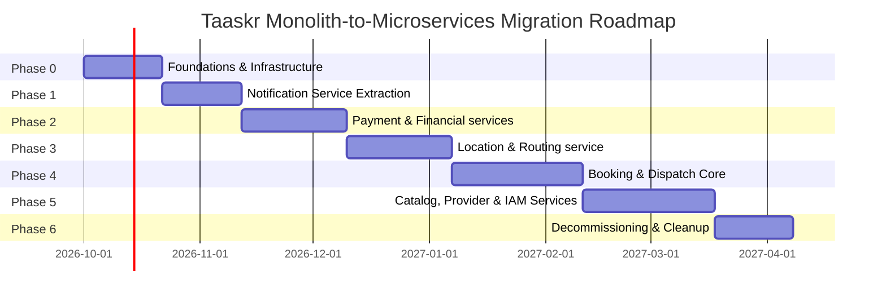

# Microservices Migration Blueprint: Taaskr Home Services Platform

---

## 1. Executive Summary

The Taaskr platform is currently a production-minded Spring Boot 3.3.2 monolith with JavaScript React web and TypeScript Expo/React Native mobile clients, managing 6 bounded contexts, 23 database tables, and ~38,500 lines of code. While the monolith features strong domain modularity and a clean N-Tier layered architecture, high tight coupling around core entities (`Booking.java`, `User.java`, `ProviderProfile.java`), shared database connection pools (`HikariCP` max-pool-size=5), and in-process synchronous event dispatching threaten scalability under peak load. 

We recommend a **Strangler Fig Pattern** combined with **Domain-Driven Service Decomposition**, extracting domain capabilities incrementally behind an API Gateway without rewriting the system from scratch.

```
       ┌─────────────────────────────────────────────────────────────┐
       │               Clients (Web, Mobile, Admin)                  │
       └──────────────────────────────┬──────────────────────────────┘
                                      │
       ┌──────────────────────────────▼──────────────────────────────┐
       │                API Gateway / BFF Layer                      │
       └──────────────┬───────────────────────────────┬──────────────┘
                      │                               │
       ┌──────────────▼──────────────┐  ┌─────────────▼──────────────┐
       │   Extracted Microservices   │  │   Legacy Taaskr Monolith   │
       │ (Notification, Payment, etc)│  │   (Core Booking & IAM)     │
       └─────────────────────────────┘  └────────────────────────────┘
```

* **Expected Benefits:** Independent service scaling, isolated transactional blast radiuses, zero-downtime deployments, improved fault isolation, and unblocked developer velocities across autonomous domain teams.
* **Key Risks:** Distributed data consistency challenges, network latency across IPC boundary crossings, data synchronization overhead during dual-write phases, and operational complexity of running a distributed event architecture.
* **High-Level Timeline:** 24 to 28 weeks across 7 distinct migration phases.

---

## 2. Recommended Service Decomposition (Final Target State)

We decompose the monolith into **7 target microservices** aligned with domain bounded contexts:

```
                               ┌───────────────────┐
                               │ Web & Mobile Clients
                               └─────────┬─────────┘
                                         │
                               ┌─────────▼─────────┐
                               │  Spring Gateway   │
                               └─────────┬─────────┘
                                         │
       ┌──────────────┬──────────────┬───┴───┬──────────────┬──────────────┬──────────────┐
       │              │              │       │              │              │              │
┌──────▼─────┐ ┌──────▼─────┐ ┌──────▼─────┐ │ ┌────────────▼──┐ ┌─────────▼────┐ ┌───────▼────┐
│IAM & User  │ │Service     │ │Booking &   │ │ │Payment &      │ │Notification  │ │Location &  │
│Service     │ │Catalog     │ │Dispatch    │ │ │Financials     │ │Messaging     │ │Routing     │
│(PostgreSQL)│ │(PostgreSQL)│ │(PostgreSQL)│ │ │(PostgreSQL)   │ │(MongoDB/PG)  │ │(Redis+OSRM)│
└────────────┘ └────────────┘ └────────────┘ │ └───────────────┘ └──────────────┘ └────────────┘
                                             │
                                   ┌─────────▼────────┐
                                   │Observability &   │
                                   │AI Service        │
                                   │(MySQL/Prometheus)│
                                   └──────────────────┘
```

### 1. `taaskr-iam-service` (Identity & Access Management)
* **Core Responsibilities:** User registration, authentication, JWT issuance/validation, address book, and RBAC authorization.
* **Data Ownership:** `users`, `addresses`.
* **Primary Interfaces:** REST (`/api/v1/auth/*`, `/api/v1/addresses/*`), Event (`user.registered`, `user.updated`).
* **Tech Stack:** Spring Boot 3.3 / Java 17 + PostgreSQL.

### 2. `taaskr-catalog-service` (Service Catalog & Pricing Engine)
* **Core Responsibilities:** Master service hierarchy (*Civil & Property Maintenance*, *Vehicle Care*, *Cleaning*, etc.), variant metadata, and vehicle/area-based pricing engine rules.
* **Data Ownership:** `service_categories`, `services`, `vehicles`, `vehicle_pricing_rules`, `user_favorite_services`.
* **Primary Interfaces:** REST (`/api/v1/categories/*`, `/api/v1/services/*`), Event (`service.price_updated`).
* **Tech Stack:** Spring Boot 3.3 / Java 17 + PostgreSQL + Caffeine Cache.

### 3. `taaskr-booking-service` (Booking & Dispatch Lifecycle)
* **Core Responsibilities:** Booking state machine transitions (`PENDING`, `CONFIRMED`, `IN_PROGRESS`, `COMPLETED`, `CANCELLED`), OTP verification, provider auto-dispatch, and dispute logging.
* **Data Ownership:** `bookings`, `availability_slots`, `idempotency_records`, `reviews`, `disputes`.
* **Primary Interfaces:** REST (`/api/v1/bookings/*`), Event (`booking.created`, `booking.assigned`, `booking.completed`, `booking.cancelled`).
* **Tech Stack:** Spring Boot 3.3 / Java 17 + PostgreSQL.

### 4. `taaskr-payment-service` (Payment, Wallet & Payouts)
* **Core Responsibilities:** Razorpay payment gateway order management, wallet ledger credit/debit balances, 15% platform commission splits, and provider payout reconciliation with pessimistic locking.
* **Data Ownership:** `payments`, `payouts`, `wallet_transactions`.
* **Primary Interfaces:** REST (`/api/v1/payments/*`, `/api/v1/payouts/*`), Razorpay Webhooks, Event (`payment.completed`, `payout.processed`).
* **Tech Stack:** Spring Boot 3.3 / Java 17 + PostgreSQL.

### 5. `taaskr-notification-service` (Messaging & Push Notifications)
* **Core Responsibilities:** Asynchronous SMS dispatch (Fast2SMS/Twilio), email templates (Brevo/Resend), Expo push notification deliveries, and push token registration.
* **Data Ownership:** `device_push_tokens`, `notification_logs`.
* **Primary Interfaces:** Event Consumer (`booking.*`, `payment.*`, `user.*`), REST (`/api/v1/notifications/tokens`).
* **Tech Stack:** Node.js / NestJS or Spring Boot 3.3 + MongoDB / PostgreSQL.

### 6. `taaskr-location-service` (Location & Geospatial Routing)
* **Core Responsibilities:** OSRM road matrix route calculations, real-time provider location tracking, ETA estimation, and STOMP WebSocket tracking streams.
* **Data Ownership:** Real-time provider geospatial positions (Redis Geospatial index).
* **Primary Interfaces:** WebSocket (`/ws-tracking`), REST (`/api/v1/routing/eta`), Event Consumer (`provider.location_updated`).
* **Tech Stack:** Node.js / Go + Redis + OSRM Engine.

### 7. `taaskr-provider-service` (Provider Profile & Onboarding)
* **Core Responsibilities:** Provider registration, category/service capability mapping, KYC document storage & verification, partner discussion forums.
* **Data Ownership:** `provider_profiles`, `provider_categories`, `provider_services`, `kyc_documents`, `partner_discussions`, `discussion_messages`.
* **Primary Interfaces:** REST (`/api/v1/providers/*`, `/api/v1/kyc/*`, `/api/v1/partners/*`), Event (`provider.kyc_verified`).
* **Tech Stack:** Spring Boot 3.3 / Java 17 + PostgreSQL.

### 8. `taaskr-observability-service` (AI Diagnostics & System Health)
* **Core Responsibilities:** Custom HTTP endpoint health probes, automated failure alerts, Gemini/OpenAI log diagnosis, Prometheus metric collation.
* **Data Ownership:** `monitored_endpoints`, `health_check_results`, `system_alerts`.
* **Primary Interfaces:** REST (`/api/v1/admin/ai/*`, `/api/v1/public/health/*`).
* **Tech Stack:** Spring Boot 3.3 / Java 17 + MySQL / TimescaleDB.

---

## 3. Migration Phases & Timeline (Recommended Order)



| Phase | Service / Scope | Duration | Key Deliverables | Prerequisites | Risk Level & Mitigation |
| :--- | :--- | :--- | :--- | :--- | :--- |
| **Phase 0** | Infrastructure Foundations | 3 Weeks | Spring Cloud Gateway, RabbitMQ setup, Debezium CDC pipeline, Prometheus/Grafana integration, OpenTelemetry tracing. | Existing monolith Docker & GitHub Actions setup. | **Low**: No business logic changes. Rollback easily by bypassing gateway. |
| **Phase 1** | `taaskr-notification-service` | 3 Weeks | Isolated notification service, RabbitMQ consumer replacing `NotificationEventListener.java`. | Phase 0 message broker. | **Low**: Asynchronous notification failures do not break customer checkout. |
| **Phase 2** | `taaskr-payment-service` | 4 Weeks | Dedicated payments DB schema, Razorpay webhook migration, Transactional Outbox pattern for payment status. | Phase 1 event infrastructure. | **High**: Financial transactions. Mitigate via dual-write verification & shadow traffic testing. |
| **Phase 3** | `taaskr-location-service` | 4 Weeks | Standalone WebSocket tracking service, Redis geospatial store, OSRM client offloading. | Phase 0 API Gateway with WebSocket support. | **Medium**: Real-time GPS stream drops. Mitigate via client reconnect logic & fallback REST API. |
| **Phase 4** | `taaskr-booking-service` | 5 Weeks | Extract core booking state machine, saga orchestrator for dispatch, decouple direct JPA relationships to `User` and `Provider`. | Phases 1–3 completed. | **High**: Core user flow. Mitigate via Strangler Fig route switching per customer cohort. |
| **Phase 5** | Catalog, Provider & IAM | 5 Weeks | Extract `taaskr-iam-service`, `taaskr-catalog-service`, and `taaskr-provider-service`. Break database foreign keys. | Phase 4 completed. | **Medium**: Broken references. Mitigate via Anti-Corruption Layers (ACL). |
| **Phase 6** | Decommissioning & Cleanup | 3 Weeks | Final data cleanup, remove monolith legacy code, decommission legacy database tables. | All traffic routed through gateway to microservices. | **Low**: Comprehensive regression testing before dropping old schemas. |

---

## 4. Data Strategy (Database-per-Service)

### Database Splitting Strategy
The current single MySQL schema (`taaskr_db`) will be decomposed into **Database-per-Service** instances.

```
Monolithic Shared DB              Target Database-per-Service Architecture
┌─────────────────────────┐       ┌─────────────────┐  ┌─────────────────┐
│        taaskr_db        │       │   iam_db (PG)   │  │ catalog_db (PG) │
│ ┌─────────────────────┐ │       │ (users, addrs)  │  │ (categories,..) │
│ │ users, addresses    │ │ ────► └─────────────────┘  └─────────────────┘
│ │ categories, services│ │       ┌─────────────────┐  ┌─────────────────┐
│ │ bookings, payments  │ │       │ booking_db (PG) │  │ payment_db (PG) │
│ └─────────────────────┘ │       │ (bookings, ..)  │  │ (payments, ..)  │
└─────────────────────────┘       └─────────────────┘  └─────────────────┘
```

### Table Allocation Map
* **`iam_db`**: `users`, `addresses`
* **`catalog_db`**: `service_categories`, `services`, `vehicles`, `vehicle_pricing_rules`, `user_favorite_services`
* **`booking_db`**: `bookings`, `availability_slots`, `idempotency_records`, `reviews`, `disputes`
* **`payment_db`**: `payments`, `payouts`, `wallet_transactions`
* **`notification_db`**: `device_push_tokens`
* **`provider_db`**: `provider_profiles`, `provider_categories`, `provider_services`, `kyc_documents`, `partner_discussions`, `discussion_messages`
* **`observability_db`**: `monitored_endpoints`, `health_check_results`, `system_alerts`

### Handling Foreign-Key Relationships
1. **Remove Hard Database Foreign Keys:** In `Booking.java`, remove `@ManyToOne User user`, `@ManyToOne Service service`, and `@ManyToOne ProviderProfile provider`. Replace with immutable primitive IDs: `userId` (Long), `serviceId` (Long), `providerId` (Long).
2. **Data Hydration via API Gateway / BFF:** The API Gateway or BFF layer calls `taaskr-booking-service` for booking details, then asynchronously hydrates user name/phone from `taaskr-iam-service` and service details from `taaskr-catalog-service` before returning to client.

### Data Consistency & Distributed Transactions
* **Transactional Outbox Pattern:** To ensure database writes and event publishing occur atomically, services write domain events to an local `outbox_events` table within the same local database transaction. A background process (Debezium or Spring Scheduled poller) reads `outbox_events` and pushes to RabbitMQ.
* **Saga Pattern (Choreography):** Replaces distributed 2PC transactions during booking creation:
  1. `taaskr-booking-service` creates booking in `PENDING` state and emits `BookingCreatedEvent`.
  2. `taaskr-payment-service` consumes event, authorizes payment with Razorpay, and emits `PaymentAuthorizedEvent`.
  3. `taaskr-booking-service` transitions booking state to `CONFIRMED`.
  4. If payment fails, `taaskr-payment-service` emits `PaymentFailedEvent`, causing `taaskr-booking-service` to run a compensating transaction transitioning booking to `CANCELLED`.

---

## 5. Communication & Integration Architecture

### Inter-Service Communication Matrix

| Source Service | Target Service | Interaction Type | Transport / Protocol | Trigger / Event |
| :--- | :--- | :--- | :--- | :--- |
| `taaskr-booking-service` | `taaskr-notification-service` | Asynchronous | RabbitMQ | `booking.created`, `booking.completed` |
| `taaskr-booking-service` | `taaskr-payment-service` | Asynchronous | RabbitMQ | `booking.completed` |
| `taaskr-payment-service` | `taaskr-notification-service` | Asynchronous | RabbitMQ | `payout.processed` |
| `taaskr-booking-service` | `taaskr-location-service` | Synchronous | REST / gRPC | Fetch provider ETA during auto-dispatch |
| API Gateway / BFF | All Microservices | Synchronous | REST / HTTP | Client web/mobile HTTP requests |

### Message Broker Topic Hierarchy (RabbitMQ Exchanges & Queues)
* **Exchange:** `taaskr.events` (Topic Exchange)
  * Routing Key `taaskr.booking.created` ➔ Queue: `notification.booking-created.queue`
  * Routing Key `taaskr.booking.completed` ➔ Queue: `payment.booking-completed.queue`
  * Routing Key `taaskr.payment.failed` ➔ Queue: `booking.payment-failed.queue`
  * Routing Key `taaskr.payout.processed` ➔ Queue: `notification.payout-processed.queue`

### API Gateway / BFF Strategy
Implement **Spring Cloud Gateway** as the single entrance point for clients:
* **Web BFF Route:** `https://api.taaskr.com/api/v1/*`
* **Mobile BFF Route:** `https://m-api.taaskr.com/api/v1/*`
* **Authentication Handling:** Gateway validates JWT tokens using a lightweight filter before proxying requests to downstream microservices, passing claims via headers (`X-User-Id`, `X-User-Role`).

### Real-time STOMP WebSocket Handling
* Move WebSocket connections from the monolith's `WebSocketConfig.java` to `taaskr-location-service`.
* Mobile and Web clients connect directly to `wss://api.taaskr.com/ws-tracking`. `taaskr-location-service` maintains active socket sessions in Redis and broadcasts provider coordinates in real time.

---

## 6. First Service Extraction – Detailed Plan (`taaskr-notification-service`)

### Service Overview & Responsibilities
* **Name:** `taaskr-notification-service`
* **Core Function:** Offload SMS sending (Fast2SMS/Twilio), email rendering & dispatch (Brevo/Resend), and push notification pushes (Expo) from the main API thread pool.
* **Data Ownership:** Owns `device_push_tokens` table.

```
Monolith                                                  New Microservice
┌────────────────────────┐      RabbitMQ Event            ┌─────────────────────────────┐
│ BookingServiceImpl     │───────────────────────────────►│ NotificationConsumer        │
│ (Publishes event)      │  "taaskr.booking.created"      └──────────────┬──────────────┘
└────────────────────────┘                                               │
                                                          ┌──────────────▼──────────────┐
                                                          │ PushNotificationService     │
                                                          │ (Twilio / Brevo / Expo)     │
                                                          └─────────────────────────────┘
```

### Step-by-Step Extraction Strategy
1. **Deploy Message Broker:** Spin up RabbitMQ container service in `docker-compose.yml`.
2. **Implement Anti-Corruption Layer (ACL) in Monolith:** Modify `NotificationEventListener.java` to publish `BookingCreatedEvent` and `PayoutCompletedEvent` onto RabbitMQ exchange `taaskr.events` instead of handling them synchronously inside JVM.
3. **Build `taaskr-notification-service` Repository Skeleton:**
```
taaskr-notification-service/
├── src/main/java/com/taaskr/notification/
│   ├── TaaskrNotificationApplication.java
│   ├── config/
│   │   ├── RabbitMQConfig.java
│   │   └── AsyncConfig.java
│   ├── consumer/
│   │   ├── BookingEventConsumer.java
│   │   └── PayoutEventConsumer.java
│   ├── controller/
│   │   └── PushTokenController.java
│   ├── entity/
│   │   └── DevicePushToken.java
│   ├── repository/
│   │   └── DevicePushTokenRepository.java
│   └── service/
│       ├── EmailService.java
│       ├── SmsService.java
│       └── PushNotificationService.java
└── pom.xml
```

4. **Migrate Notification Logic:** Copy `EmailServiceImpl.java`, `SmsServiceImpl.java`, and `PushNotificationServiceImpl.java` to `taaskr-notification-service`.
5. **Dark Launch & Dual Execution:** Run notification dispatch in parallel for 3 days. Verify notification delivery parity via Prometheus metrics.
6. **Cutover:** Disable `@Async` listeners in monolith. Route all push token API calls to `taaskr-notification-service`.

---

## 7. Technology & Tooling Recommendations

| Capability | Recommended Tool / Tech | Current Monolith Component | Action / Migration Plan |
| :--- | :--- | :--- | :--- |
| **API Gateway** | Spring Cloud Gateway | None (direct Spring Security) | Introduce as single ingress controller. |
| **Message Broker** | RabbitMQ / Apache Kafka | In-memory `ApplicationEventPublisher` | Deploy RabbitMQ for async event bus. |
| **Service Discovery** | HashiCorp Consul / Eureka | Hardcoded local URLs | Register extracted microservices. |
| **Distributed Cache** | Redis Cluster | Caffeine in-memory cache | Replace Caffeine with Redis for cross-service caching. |
| **Geospatial Engine** | OSRM Docker container | OSRM container (`docker-compose.osrm.yml`) | Retain OSRM, encapsulate behind `taaskr-location-service`. |
| **Payment Gateway** | Razorpay Java SDK 1.4.8 | `RazorpayConfig.java` | Move SDK dependency into `taaskr-payment-service`. |
| **Observability** | Prometheus + Grafana + OpenTelemetry | `docker-compose.monitoring.yml` | Extend Prometheus scrapers to collect metrics from all microservice endpoints. |
| **CI/CD Pipeline** | GitHub Actions | `.github/workflows/ci-cd-observability.yml` | Update pipeline to build and test individual microservice Docker images independently. |

---

## 8. Team, Process & Governance

### Team Structure Alignment (Conway's Law)
* **Core Platform & IAM Team:** Owns `taaskr-iam-service`, API Gateway, CI/CD pipelines, and infrastructure.
* **Customer Booking & Catalog Team:** Owns `taaskr-booking-service` and `taaskr-catalog-service`.
* **Payments & Financials Team:** Owns `taaskr-payment-service` (Payments, Wallets, Payouts).
* **Provider & Operations Team:** Owns `taaskr-provider-service`, `taaskr-notification-service`, and `taaskr-location-service`.

### Architectural Decision Records (ADRs) to Establish
1. **ADR-001:** Adoption of Strangler Fig Pattern for Taaskr Monolith Migration.
2. **ADR-002:** Standardizing RabbitMQ as the Event Bus for Asynchronous IPC.
3. **ADR-003:** Enforcement of Database-per-Service and Removal of Foreign Keys.
4. **ADR-004:** Implementation of Transactional Outbox Pattern for Distributed Consistency.

---

## 9. Risk Register & Mitigation Matrix

| Risk ID | Risk Description | Likelihood | Impact | Concrete Mitigation Strategy |
| :--- | :--- | :--- | :--- | :--- |
| **R-01** | **Payment Double-Charge / Payout Loss** during payment service extraction | Low | High | Use pessimistic DB locking (`SELECT FOR UPDATE`), implement Razorpay webhook idempotency records (`idempotency_records` table). |
| **R-02** | **Distributed Transaction Failures** when booking creation succeeds but payment fails | Medium | High | Implement Choreography Saga pattern with compensating state transitions (`CANCELLED`). |
| **R-03** | **Network Latency Overhead** from multi-hop HTTP calls across microservices | High | Medium | Enforce asynchronous event communication for non-blocking operations; use Redis for hot state. |
| **R-04** | **Data Inconsistency** between `users` table in IAM and `bookings` table | Medium | Medium | Use eventual consistency via `user.updated` events; hydrate data at API Gateway layer. |
| **R-05** | **WebSocket Connection Drops** during location service migration | Medium | Medium | Implement auto-reconnect fallback in mobile client (`taaskr-mobile`) using Expo background task listener. |
| **R-06** | **Database Connection Exhaustion** when running multiple standalone microservices | High | High | Tune HikariCP pool sizes per service (max-pool-size=10); utilize PgBouncer / ProxySQL connection poolers. |
| **R-07** | **Notification Storms / Duplicate SMS** during event bus migration | Low | Low | Enforce deduplication keys in `taaskr-notification-service` consumer. |
| **R-08** | **Cascading Service Failures** when one microservice goes down | Medium | High | Implement Resilience4j circuit breakers and fallback responses in Spring Cloud Gateway. |

---

## 10. Immediate Next Actions (Next 2–4 Weeks)

```
Week 1: Broker & Event Ingress Setup
 ├── Deploy RabbitMQ container in docker-compose.yml
 └── Create outbox_events schema migration script

Week 2: Notification Extraction Preparation
 ├── Instantiate taaskr-notification-service project shell
 └── Refactor NotificationEventListener to publish to RabbitMQ

Week 3: Dual Execution & Dark Launch
 ├── Deploy taaskr-notification-service to staging environment
 └── Validate delivery metrics parity in Grafana dashboard

Week 4: Production Cutover
 ├── Route notification APIs to new microservice via Gateway
 └── Deprecate legacy notification listeners in monolith
```

* **Action 1:** Spin up a local RabbitMQ instance using `docker-compose` and create the `taaskr.events` exchange.
* **Action 2:** Create the `outbox_events` table script in `DatabaseSchemaMigrationRunner.java` for atomic event publishing.
* **Action 3:** Initialize the Maven project skeleton for `taaskr-notification-service`.
* **Action 4:** Update `.github/workflows/ci-cd-observability.yml` to support multi-image docker builds.

---

## 11. Open Questions for Infrastructure & Business Teams

1. **Cloud Hosting Environment:** Will the microservices be deployed on Kubernetes (EKS/GKE), AWS ECS, or standalone Docker instances?
2. **Message Broker Preference:** Does the team prefer managed AWS SQS/SNS or self-hosted RabbitMQ/Kafka in production?
3. **Database Scaling Budget:** Is there a budget allocated for managed database instances per microservice (e.g., multiple Aiven MySQL/PostgreSQL instances)?
4. **Third-Party Rate Limits:** Are there rate limits on Twilio / Fast2SMS API keys that need throttling controls inside `taaskr-notification-service`?
