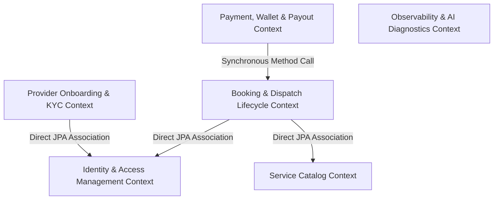
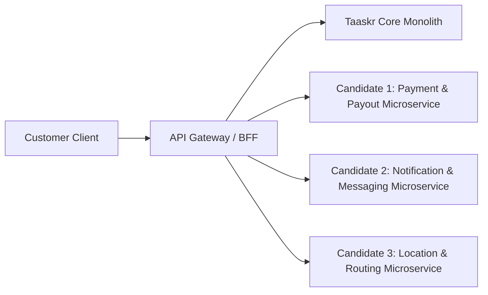

# Monolith Assessment Report: Taaskr Home Services Platform

## 1. Project Overview & Metadata

### Primary Language(s), Framework(s), and Runtime Version(s)
* **Backend Monolith:**
  * **Language:** Java 17 (`<java.version>17</java.version>`)
  * **Framework:** Spring Boot `3.3.2` (`spring-boot-starter-web`, `spring-boot-starter-data-jpa`, `spring-boot-starter-security`, `spring-boot-starter-websocket`, `spring-boot-starter-actuator`)
  * **Runtime:** OpenJDK / Eclipse Temurin 17 JRE
* **Web Frontend Client:**
  * **Language:** JavaScript (ESNext / JSX)
  * **Framework:** React `19.2.8`, React Router `7.18.2`, Vite `6.0.7`, Lucide React, Recharts, Leaflet, SockJS / STOMP.js
* **Mobile Client:**
  * **Language:** TypeScript (`~6.0.3`) / TSX
  * **Framework:** React Native `0.86.3`, Expo `57.0.24`, `@tanstack/react-query` `5.103.1`, Zustand `5.0.15`, React Navigation `7.x`

### Build Tool(s) and Package Manager(s)
* **Backend:** Apache Maven (`mvnw` wrapper, `pom.xml`, `maven-compiler-plugin` 3.13.0)
* **Web Frontend:** `npm` (Node.js 20 runtime, `package.json`, Vite bundler, Oxlint)
* **Mobile App:** `npm` / Expo CLI (`package.json`, `app.json`, Expo Dev Client)

### Total Lines of Code & High-Level Folder Structure
* **Total Lines of Code:** ~38,500 LOC across Backend, Frontend, and Mobile repositories.
* **High-Level Repository Structure:**
```
Taaskr/
├── .github/
│   └── workflows/
│       └── ci-cd-observability.yml     # GitHub Actions pipeline
├── docker-compose.monitoring.yml       # Prometheus & Grafana stack
├── docker-compose.osrm.yml             # OSRM Road Routing engine container
├── OSRM_SETUP_GUIDE.md
├── TAASKR_PRODUCT_CONTEXT.md
├── taaskr-backend/                     # Spring Boot Monolith
│   ├── Dockerfile
│   ├── pom.xml
│   └── src/
│       ├── main/
│       │   ├── java/com/taaskr/
│       │   │   ├── config/             # DB schema migration, security, cache, async, websocket
│       │   │   ├── controller/         # REST & WebSocket API endpoints (Admin, Public, Provider, User)
│       │   │   ├── dto/                # Data Transfer Objects (Request/Response contracts)
│       │   │   ├── entity/             # JPA Database Entities (Booking, Service, User, Payout, etc.)
│       │   │   ├── enums/              # Domain enums (BookingStatus, Role, PaymentStatus, etc.)
│       │   │   ├── event/              # Spring Application Context Events
│       │   │   ├── exception/          # Custom runtime exception hierarchy
│       │   │   ├── listener/           # Domain event listeners (Async notifications)
│       │   │   ├── repository/         # Spring Data JPA Repositories
│       │   │   ├── security/           # JWT authentication, security filter chain, RBAC
│       │   │   ├── service/            # Core business domain interfaces & implementations
│       │   │   └── util/               # Helper utilities (PDF generator, CSV parsers)
│       │   └── resources/              # application.properties, application-prod.properties
│       └── test/java/com/taaskr/       # Integration & Unit test suite (18 test suites)
├── taaskr-frontend/                    # Vite + React Single Page Application (SPA)
│   ├── package.json
│   ├── src/
│   │   ├── components/                 # Modals, Navbar, Footer, Route Guards
│   │   ├── data/                       # Service mock/seed metadata mapping
│   │   ├── pages/                      # Customer, Provider & Admin Portal Views
│   │   └── services/                   # Axios/Fetch API client wrappers
└── taaskr-mobile/                      # Expo + React Native Cross-Platform App
    ├── package.json
    └── src/
        ├── api/                        # React Query REST API client
        ├── components/                 # Native UI components
        ├── navigation/                 # Native stack & tab navigators
        └── screens/                    # Mobile screen components (Auth, Catalog, Booking, Map Tracking)
```

### Deployment Target(s) Today
* **Production Database:** Aiven Managed MySQL instance (`jdbc:mysql://${DB_HOST}:${DB_PORT}/${DB_NAME}?sslMode=REQUIRED`).
* **Containerization:** Single multi-stage Docker build for backend (`taaskr-backend/Dockerfile`) exposing port `8081`.
* **Routing Engine:** Self-hosted OSRM (Open Source Routing Machine) Docker container (`osrm/osrm-backend`).
* **Monitoring Stack:** Prometheus (`prom/prometheus:v2.53.0`) + Grafana (`grafana/grafana:11.0.0`) via `docker-compose.monitoring.yml`.

### Existing CI/CD Configuration
* **GitHub Actions Workflow:** `.github/workflows/ci-cd-observability.yml`
  * Runs Java 17 backend build with an ephemeral MySQL 8.0 container service (`mvn test -Dspring.profiles.active=test`).
  * Runs Node.js 20 frontend build validation (`npm ci`, `npm run build`).
  * Validates Docker Compose monitoring configurations (`docker compose -f docker-compose.monitoring.yml config`).

---

## 2. Domain & Business Capabilities

The monolith encompasses 6 major Bounded Contexts residing in a single shared JVM process and database schema:



### 1. Identity & Access Management (IAM) Domain
* **Primary Responsibilities:** User authentication, password encryption, JWT issuance/validation, role-based access control (CUSTOMER, SERVICE_PROVIDER, ADMIN), user profile & saved addresses.
* **Key Entities:** `User`, `Address`, `DevicePushToken`.
* **Main Entry Points:** `AuthController` (`/api/auth/*`), `AddressController` (`/api/addresses/*`).
* **Data Stores Used:** Tables `users`, `addresses`, `device_push_tokens`.
* **Team/Owner:** Core Platform Team.

### 2. Service Catalog & Pricing Domain
* **Primary Responsibilities:** Service categories (e.g., *Civil & Property Maintenance*, *Vehicle Care*, *Cleaning*), service sub-types, variant metadata, dynamic vehicle & area-based pricing rules.
* **Key Entities:** `ServiceCategory`, `Service`, `Vehicle`, `VehiclePricingRule`, `UserFavoriteService`.
* **Main Entry Points:** `PublicCatalogController` (`/api/public/categories`), `VehicleController` (`/api/vehicles/*`), `AdminCatalogController` (`/api/admin/services/*`).
* **Data Stores Used:** Tables `service_categories`, `services`, `vehicles`, `vehicle_pricing_rules`, `user_favorite_services`.

### 3. Booking & Dispatch Lifecycle Domain
* **Primary Responsibilities:** Booking creation, algorithm-based provider matching/dispatch, status state machine transitions (`PENDING`, `CONFIRMED`, `IN_PROGRESS`, `COMPLETED`, `CANCELLED`), real-time GPS tracking, OTP verification.
* **Key Entities:** `Booking`, `AvailabilitySlot`, `IdempotencyRecord`.
* **Main Entry Points:** `BookingController` (`/api/bookings/*`), `TrackingController` (`/api/tracking/*`), `TrackingWebSocketController` (`/ws-tracking`).
* **Data Stores Used:** Tables `bookings`, `availability_slots`, `idempotency_records`.

### 4. Payment, Wallet & Financial Reconciliation Domain
* **Primary Responsibilities:** Razorpay order generation & signature verification, platform commission calculations (15%), wallet credit/debit transactions, provider payout scheduling with pessimistic lock reconciliation.
* **Key Entities:** `Payment`, `Payout`, `WalletTransaction`.
* **Main Entry Points:** `PaymentController` (`/api/payments/*`), `PayoutController` (`/api/payouts/*`).
* **Data Stores Used:** Tables `payments`, `payouts`, `wallet_transactions`.

### 5. Provider Management & Onboarding Domain
* **Primary Responsibilities:** Provider registration, service category mapping, KYC document upload & admin verification, partner community discussion boards.
* **Key Entities:** `ProviderProfile`, `ProviderCategory`, `ProviderService`, `KycDocument`, `PartnerDiscussion`, `DiscussionMessage`.
* **Main Entry Points:** `ProviderController` (`/api/providers/*`), `KycDocumentController` (`/api/kyc/*`), `PartnerController` (`/api/partners/*`).
* **Data Stores Used:** Tables `provider_profiles`, `provider_categories`, `provider_services`, `kyc_documents`, `partner_discussions`, `discussion_messages`.

### 6. Observability & AI Diagnostic Domain
* **Primary Responsibilities:** Custom HTTP endpoint health probes, automated failure alerts, AI-driven failure diagnosis via Google Gemini / OpenAI, Prometheus metric exports.
* **Key Entities:** `MonitoredEndpoint`, `HealthCheckResult`, `SystemAlert`.
* **Main Entry Points:** `AiController` (`/api/admin/ai/*`), `PublicObservabilityHealthController` (`/api/public/health/*`).
* **Data Stores Used:** Tables `monitored_endpoints`, `health_check_results`, `system_alerts`.

---

## 3. Technical Architecture & Layers

### Overall Architectural Style
The backend follows a classic **Traditional Layered (N-Tier) Monolith Architecture** with Spring MVC annotations.

```
┌─────────────────────────────────────────────────────────┐
│                 Controller Layer (REST/WS)               │
│ (BookingController, AuthController, ProviderController) │
└───────────────────────────┬─────────────────────────────┘
                            │
┌───────────────────────────▼─────────────────────────────┐
│                   Service Interface Layer                │
│    (BookingService, AuthService, ProviderWorkflowService)│
└───────────────────────────┬─────────────────────────────┘
                            │
┌───────────────────────────▼─────────────────────────────┐
│                 JPA Data Access Repositories             │
│ (BookingRepository, UserRepository, ServiceRepository)  │
└───────────────────────────┬─────────────────────────────┘
                            │
┌───────────────────────────▼─────────────────────────────┐
│                 Shared Database (MySQL / H2)            │
└─────────────────────────────────────────────────────────┘
```

### Layer Mapping & Examples
* **Presentation Layer:** Controllers in `com.taaskr.controller.*` handle HTTP mapping, JSON serializations, and standard response wrapping (`ApiResponse<T>`).
* **Application / Business Layer:** Classes in `com.taaskr.service.impl.*` (e.g., `BookingServiceImpl.java`) contain transaction boundaries (`@Transactional`) and direct business orchestration logic.
* **Domain Layer:** JPA Entities in `com.taaskr.entity.*` holding fields and basic getters/setters. Little to no rich domain encapsulation (Anemic Domain Model).
* **Infrastructure Layer:** Classes in `com.taaskr.config.*` (Security, CORS, WebSockets, Caching, Schema Migration) and external integrations (`EmailServiceImpl`, `SmsServiceImpl`, `RazorpayConfig`).

### Cross-Cutting Concerns
* **Authentication & Authorization:** Implemented via Spring Security filter chain (`SecurityConfig.java`) and stateless JWT parsing in `JwtAuthenticationFilter.java`. Role-based authorization uses `@PreAuthorize("hasRole('ADMIN')")`.
* **Logging:** Standard SLF4J with Logback fallback.
* **Configuration:** Centralized in `application.properties` with environment variable overrides (`${DB_HOST}`, `${JWT_SECRET}`).
* **Validation:** Spring Starter Validation using JSR-303 annotations (`@Valid`, `@NotNull`, `@NotBlank`) in DTOs.
* **Caching:** Spring Cache abstraction backed by Caffeine or Redis in `CacheConfig.java`. `@Cacheable(value = "services")` is used for catalog lookups.
* **Error Handling:** Global exception handling using `@RestControllerAdvice` in `GlobalExceptionHandler.java`.

---

## 4. Communication Patterns (Internal & External)

### Synchronous Communication Mechanisms
* **External Clients to Backend:** RESTful APIs over HTTP/HTTPS with JSON payloads.
* **Internal OSRM Integration:** Synchronous `RestTemplate` calls inside `OsrmRoutingServiceImpl.java` to compute distance and travel times:
```java
// Synchronous HTTP call inside monolith to external OSRM service
String url = String.format("%s/route/v1/driving/%f,%f;%f,%f?overview=false", 
    baseUrl, startLng, startLat, endLng, endLat);
ResponseEntity<OsrmResponse> response = restTemplate.getForEntity(url, OsrmResponse.class);
```

### Asynchronous & Messaging Mechanisms
* **Spring Application Event Publisher:** In-process, in-memory event dispatching (`eventPublisher.publishEvent(...)`).
  * Example: `BookingServiceImpl` publishes `BookingCreatedEvent`.
  * `NotificationEventListener.java` captures the event asynchronously with `@Async` to trigger SMS and emails.
* **WebSocket / STOMP Broker:** Real-time push notifications and live GPS position streaming via Spring WebSocket (`WebSocketConfig.java` endpoint `/ws-tracking`).
* **Message Queue / Broker (Kafka/RabbitMQ):** *Not found in the provided codebase.* All event propagation is in-memory JVM-bound.

### Inter-Module / In-Process Boundary Crossing
Because all business capabilities reside within one monolithic application, boundary crossings are **direct synchronous Java method invocations** between Spring beans across package boundaries.

Example from `BookingServiceImpl.java`:
```java
// Direct, synchronous method call crossing Booking -> Vehicle Pricing context
BigDecimal finalPrice = vehiclePricingService.calculatePrice(
    vehicle, service, request.getServiceCategory(), request.getBookingDate());
```

### External Integrations
1. **Razorpay Payments API:** `com.razorpay.RazorpayClient` for order creation and webhook verification.
2. **Brevo / Resend Email APIs:** HTTP REST fallback integrations in `EmailServiceImpl.java`.
3. **Fast2SMS / Twilio SMS APIs:** REST API integrations in `SmsServiceImpl.java`.
4. **Google Gemini & OpenAI APIs:** AI Diagnostic log analysis in `AiDiagnosticServiceImpl.java`.
5. **OSRM Engine:** External container for matrix routing calculation in `OsrmRoutingServiceImpl.java`.

---

## 5. Data Architecture & Database(s)

### Database List & Schemas
* **Production Database:** Single relational database (Aiven MySQL 8.0) storing all business tables in a **single default schema** (`taaskr_db`).
* **Development / Test Database:** Embedded or file-based H2 database (`jdbc:h2:file:./data/taaskr_dev`).

### Complete List of Database Tables
The monolith contains 23 database tables managed within a single database instance:

| Table Name | Primary Business Entity | Primary Foreign Keys / Ownership |
| :--- | :--- | :--- |
| `users` | `User` | - |
| `addresses` | `Address` | `user_id` -> `users(id)` |
| `device_push_tokens` | `DevicePushToken` | `user_id` -> `users(id)` |
| `service_categories` | `ServiceCategory` | - |
| `services` | `Service` | `category_id` -> `service_categories(id)` |
| `vehicles` | `Vehicle` | `user_id` -> `users(id)` |
| `vehicle_pricing_rules` | `VehiclePricingRule` | `category_id` -> `service_categories(id)` |
| `user_favorite_services` | `UserFavoriteService` | `user_id`, `service_id` |
| `provider_profiles` | `ProviderProfile` | `user_id` -> `users(id)` |
| `provider_categories` | `ProviderCategory` | `provider_id`, `category_id` |
| `provider_services` | `ProviderService` | `provider_id`, `service_id` |
| `kyc_documents` | `KycDocument` | `provider_id` -> `provider_profiles(id)` |
| `bookings` | `Booking` | `user_id`, `service_id`, `provider_id`, `service_partner_id` |
| `availability_slots` | `AvailabilitySlot` | `provider_id` -> `provider_profiles(id)` |
| `idempotency_records` | `IdempotencyRecord` | `user_id` -> `users(id)` |
| `payments` | `Payment` | `booking_id` -> `bookings(id)` |
| `payouts` | `Payout` | `provider_id` -> `provider_profiles(id)` |
| `wallet_transactions` | `WalletTransaction` | `user_id` -> `users(id)` |
| `reviews` | `Review` | `booking_id`, `user_id`, `provider_id` |
| `disputes` | `Dispute` | `booking_id` -> `bookings(id)` |
| `partner_discussions` | `PartnerDiscussion` | `author_id` -> `users(id)` |
| `discussion_messages` | `DiscussionMessage` | `discussion_id`, `sender_id` |
| `monitored_endpoints` | `MonitoredEndpoint` | - |
| `health_check_results` | `HealthCheckResult` | `endpoint_id` -> `monitored_endpoints(id)` |

### Data Ownership & Shared Schemas
* **Shared Database Schema:** All modules read and write directly to the same database tables.
* **Hard Database Foreign Keys:** Foreign keys tightly cross-link domains (e.g., `bookings` table has explicit foreign key constraints referencing `users`, `services`, and `provider_profiles`).
* **ORM Library:** Hibernate 6 / Spring Data JPA (`spring-boot-starter-data-jpa`).
* **Change Data Capture (CDC) / Replication:** *Not found in the provided codebase.* Database updates are handled via direct Hibernate SQL queries.

---

## 6. Dependencies & Coupling

### Internal Dependency Graph & Coupling Analysis
The codebase exhibits **high tight coupling** around the core `User`, `Booking`, and `ProviderProfile` entities.

```
                  ┌──────────────────────┐
                  │      User Entity     │
                  └──────────▲───────────┘
                             │ (FK user_id)
      ┌──────────────────────┼──────────────────────┐
      │                      │                      │
┌─────┴──────────┐   ┌───────┴────────┐   ┌─────────┴──────────┐
│ ProviderProfile│   │    Booking     │   │ WalletTransaction  │
└─────▲──────────┘   └───────▲────────┘   └────────────────────┘
      │ (FK provider_id)     │ (FK booking_id)
┌─────┴──────────┐   ┌───────┴────────┐
│     Payout     │   │    Payment     │
└────────────────┘   └────────────────┘
```

### Top External Library Dependencies
1. `spring-boot-starter-web`: Servlet routing, Tomcat embedded container.
2. `spring-boot-starter-data-jpa`: JPA repository abstractions & Hibernate ORM.
3. `spring-boot-starter-security`: Authentication & authorization filters.
4. `razorpay-java` (v1.4.8): Third-party payment gateway SDK.
5. `jjwt-api` / `jjwt-impl` (v0.12.6): JSON Web Token creation and decoding.
6. `caffeine`: In-memory L1 cache provider.
7. `micrometer-registry-prometheus`: Prometheus metric exposition.
8. `openpdf` (v1.3.40): PDF invoice generation.
9. `spring-boot-starter-websocket`: STOMP protocol handling.
10. `mysql-connector-j`: JDBC driver for MySQL connections.

### God Classes & Reused Utilities
* **`Booking.java` (637 LOC):** Contains 38 fields spanning booking details, vehicle details, paint service specs, payment statuses, payout amounts, cancellation reasons, and timestamps.
* **`BookingServiceImpl.java` (688 LOC):** Injects 12 separate repositories and service beans (`UserRepository`, `ServiceRepository`, `ProviderServiceRepository`, `AvailabilitySlotRepository`, `BookingRepository`, `ProviderProfileRepository`, `ProviderCategoryRepository`, `ApplicationEventPublisher`, `MapService`, `VehiclePricingService`, `VehicleEligibilityService`, `VehicleDispatchService`).
* **`DataSeeder.java` (46,387 bytes):** Seeds users, categories, sub-services, pricing rules, provider capabilities, and test data in a single file.

---

## 7. Observability, Resilience & Quality Attributes

### Logging, Metrics, Tracing & Health Checks
* **Metrics & Prometheus:** Integrated using Spring Actuator and Micrometer (`/actuator/prometheus`). Custom counter metrics exist in `AppMetricsService.java`.
* **Distributed Tracing:** *Not found in the provided codebase.* No Zipkin, Jaeger, or OpenTelemetry instrumentation currently active.
* **Health Probes:** Custom database-driven monitoring suite (`MonitoredEndpoint`, `HealthCheckResult`, `PublicObservabilityHealthController`). Exposes `/actuator/health` probe.

### Error Handling & Resilience Patterns
* **Optimistic Locking:** Enforced on high-concurrency entities (`Booking`, `ProviderProfile`, `WalletTransaction`) using JPA `@Version` columns to prevent race conditions during status updates.
* **Pessimistic Locking:** Used during financial reconciliation in `PayoutServiceImpl` via `SELECT ... FOR UPDATE` (`@Lock(LockModeType.PESSIMISTIC_WRITE)`).
* **Circuit-Breakers & Bulkheads (Resilience4j):** *Not found in the provided codebase.* External HTTP calls to OSRM, Brevo, and Fast2SMS rely on plain HTTP connection timeouts (7000ms).

---

## 8. Testing, Deployment & Operations

### Test Pyramid & Coverage
The backend features 18 test suites covering integration and workflow scenarios:
* **Unit & Integration Test Suite (`taaskr-backend/src/test/java/com/taaskr`):**
  * `BookingServiceImplTest.java` / `PaintServiceIntegrationTests.java`: Verifies booking creation, variant pricing, and provider eligibility.
  * `ProviderPayoutAndReconciliationTests.java`: Verifies concurrent wallet payouts and lock integrity.
  * `GpsTrackingIntegrityTests.java`: Verifies real-time GPS coordinates and route distance accuracy.
  * `WebSocketSecurityTests.java`: Verifies unauthorized STOMP connection rejections.

### Feature Flags & Dark Launching
* **Demo Data Seeding Flag:** Controlled via `@ConditionalOnProperty(name = "app.seed.demo-data", havingValue = "true")`.
* **SMS/Email Simulation Mode:** Controlled via `app.sms.simulation-mode=auto` and `app.email.simulation-mode=auto`.

---

## 9. Pain Points & Technical Debt

### Explicit Issues & Monolith Bottlenecks Identified in Code
1. **Monolithic Transaction Risks:** High-frequency booking updates share database connection pools (`HikariCP` max-pool-size=5 in production) with long-running analytical queries.
2. **In-Process Notification Dispatch:** Asynchronous notification listeners run on default Spring `@EnableAsync` thread pools. If mail/SMS gateways hang, worker threads fill up, threatening overall REST API throughput.
3. **Anemic Entities & Heavy Service Classes:** Business logic is concentrated inside heavy `ServiceImpl` classes rather than within rich domain models.

---

## 10. Recommended First Extraction Candidates

Based on domain boundaries, database coupling, and operational risk, the following top 3 candidates are recommended for microservice extraction:



### Candidate 1: Payment, Wallet & Payout Microservice
* **Proposed Service Name:** `taaskr-payment-service`
* **Value & Rationale:** High financial risk, requiring isolated PCI-DSS compliance, strict audit logging, and independent scaling during high-volume booking completion events.
* **Data Ownership (Tables):** `payments`, `payouts`, `wallet_transactions`.
* **Exposed Interfaces:** REST API (`POST /api/v1/payments/charge`, `POST /api/v1/payouts/settle`), Webhooks for Razorpay.
* **Migration Pattern:** **Strangler Fig Pattern**.
  1. Create `taaskr-payment-service` with its own isolated PostgreSQL/MySQL database.
  2. Implement an Anti-Corruption Layer (ACL) in the monolith to forward payment requests to the new service over REST/gRPC.
  3. Migrate historical payment tables using CDC (Debezium).

### Candidate 2: Notification & Messaging Microservice
* **Proposed Service Name:** `taaskr-notification-service`
* **Value & Rationale:** Lowest risk extraction candidate. Asynchronous by nature; isolates third-party SMS (Fast2SMS/Twilio), Push (Expo), and Email (Brevo/Resend) failures from blocking HTTP request threads.
* **Data Ownership (Tables):** `device_push_tokens`, notification logs/templates.
* **Exposed Interfaces:** Message Queue Consumer (RabbitMQ / Kafka topics: `booking.created`, `payout.completed`, `user.registered`).
* **Migration Pattern:** Event-Driven Extraction.
  1. Introduce RabbitMQ/Kafka to replace Spring `ApplicationEventPublisher`.
  2. Extract `NotificationEventListener` into `taaskr-notification-service`.

### Candidate 3: Location & OSRM Routing Microservice
* **Proposed Service Name:** `taaskr-location-service`
* **Value & Rationale:** High CPU and memory utilization due to geospatial calculations and OSRM matrix queries. Offloading location tracking prevents performance degradation of core booking services.
* **Data Ownership (Tables):** Real-time location stream (Redis geospatial cache).
* **Exposed Interfaces:** WebSocket endpoint (`/ws-tracking`), REST API (`GET /api/v1/routing/eta`).
* **Migration Pattern:** Strangler Fig with Redis Cache.

---

## 11. Additional Context Needed

To finalize the microservices migration roadmap, the following operational context should be confirmed with the infrastructure team:

1. **Target Cloud Infrastructure:** AWS (EKS/ECS), GCP (GKE), Azure, or bare-metal VPS provider.
2. **Preferred Message Broker:** Kafka vs. RabbitMQ vs. AWS SQS for cross-service asynchronous event streaming.
3. **Database Migration Policy:** Timeline for database decomposition from single MySQL instance to Database-per-Service.
4. **API Gateway Preference:** Spring Cloud Gateway, Kong, Envoy, or AWS API Gateway.
