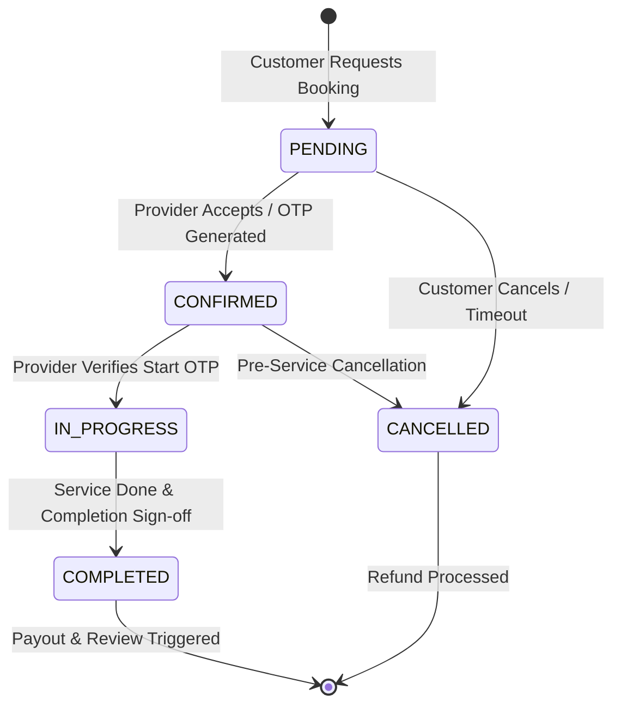

# Taaskr Platform: Ultimate Deep-Dive Technical Interview & Architecture Companion

---

## PART 1: CORE IMPLEMENTATIONS, DIAGRAMS & FOLLOW-UP Q&AS

### MODULE 1: Civil & Property Maintenance — Paint Services Feature

#### Main Interview Question:
**"How did you design and implement the production-grade Paint Services feature within Taaskr's existing architecture?"**

#### Detailed Technical Answer:
> "We integrated the **Civil & Property Maintenance ➔ Paint Services** sub-category into Taaskr's existing N-Tier Spring Boot and React architecture without creating parallel booking pipelines or duplicate database entities.
>
> 1. **Catalog & Domain Modeling:** We seeded 10 specialized paint sub-services (*Interior Wall Painting*, *Exterior Wall Painting*, *Full House Painting*, *Door & Window Painting*, *Wall Repainting*, *Texture Painting*, *Waterproof Painting*, *Commercial Painting*, *Touch-Up Painting*, *Putty & Primer Work*) under `ServiceCategory` *Civil & Property Maintenance*.
> 2. **Dynamic Area-Based Pricing Engine:** Painting cannot use simple fixed pricing. We configured `pricingType = AREA_BASED`, `unit = SQ_FT`, and `requiresInspection = true`. The estimation engine calculates:
>    $$\text{Estimated Price} = (\text{Approximate Area in Sq Ft} \times \text{Base Sq Ft Rate}) + \text{Surface Preparation Charges}$$
>    For inspection-required services, the initial booking is flagged `requiresInspection = true` with customer disclaimer *'Final price confirmed after doorstep measurement'*.
> 3. **Extensible Entity Strategy:** Instead of creating a redundant `PaintBooking` entity, we leveraged generic text fields `packageDescription` and `notes` on `Booking.java`. Custom metadata (Property Type: *Apartment/Villa/Office*, Surface Condition: *Cracks/Dampness*, Material Choice: *Customer/Provider*) is formatted as structured JSON payload and saved directly in `packageDescription`.
> 4. **Frontend & Mobile UI:** Built `PaintVariantModal.jsx` and updated category theme mapping in `Home.jsx` to render Warm Amber (`#F59E0B`) card accents, option selectors, price calculators, and hover borders matching the Civil & Property category theme.
> 5. **Verification & Seeding:** Updated `DataSeeder.java` to seed catalog records and painter provider `painter@taaskr.com`, and created `PaintServiceIntegrationTests.java` with 4/4 passing integration tests."

#### Architectural Workflow Diagram:
```
                                 PAINT SERVICE BOOKING FLOW
                                             │
Customer Selects Service ──► Modal Collects Details ──► Frontend Computes Estimate
(Interior/Exterior Paint)    (Property Type, Sq Ft,    (Area * Base Rate + Prep)
                             Surface Condition)               │
                                                              ▼
Backend Receives Request ◄── Creates Standard Booking ◄── Encodes Metadata Into
(BookingServiceImpl)        (BookingStatus.PENDING)       'packageDescription'
         │
         ▼
Provider Assigned ──► Doorstep Inspection ──► Final Quote Confirmed ──► Execution
(painter@taaskr.com)  (Measures Exact Sq Ft)  (Customer Confirms)
```

#### Follow-Up Questions & Answers:

##### Follow-Up Q1.1: Why did you choose to store paint metadata in `packageDescription` instead of creating a dedicated `PaintBooking` table?
**Answer:** Creating a separate `PaintBooking` entity would violate DRY principles and fragment the database schema. Every booking in Taaskr shares a common lifecycle (status state machine, user assignment, provider dispatch, payment, review, invoice generation). Using extensible string metadata (`packageDescription`) allowed us to store custom domain parameters while reusing 100% of existing booking services, repositories, APIs, and analytics pipelines.

##### Follow-Up Q1.2: How do you validate customer-entered square footage and surface conditions on the backend?
**Answer:** The request DTO uses JSR-303 annotations `@Positive` on numerical area fields. In `BookingServiceImpl`, the server re-computes estimated prices from authoritative database rate rules rather than trusting client-submitted price totals. For inspection-required bookings, the final price is locked only after the provider submits exact measurements during the doorstep inspection phase.

---

### MODULE 2: Provider Payouts & Financial Concurrency Isolation

#### Main Interview Question:
**"How did you implement provider payout reconciliation to prevent double-payout race conditions under high concurrency?"**

#### Detailed Technical Answer:
> "In an on-demand platform, when multiple completed bookings trigger payouts simultaneously, standard read-modify-write database operations can cause double-payout balance transfers to provider wallet balances due to race conditions.
>
> 1. **Pessimistic Database Locking:** In `ProviderProfileRepository.java`, we annotated provider wallet queries with `@Lock(LockModeType.PESSIMISTIC_WRITE)` executing raw SQL `SELECT ... FOR UPDATE`. This acquires an exclusive row-level lock on the `provider_profiles` table, serializing overlapping payout transactions.
> 2. **Transaction Scope Isolation:** `PayoutServiceImpl.java` executes reconciliation inside isolated `@Transactional` scopes.
> 3. **Commission Calculation:** Platform commission (15%) is calculated and split atomically:
>    $$\text{Platform Fee} = \text{Total Amount} \times 0.15$$
>    $$\text{Provider Net Credit} = \text{Total Amount} - \text{Platform Fee}$$
> 4. **Idempotency Verification:** Before executing payout transfers, we verify `razorpay_order_id` against `idempotency_records`. If a duplicate payout request is received, the transaction returns HTTP 200 immediately without crediting the wallet again."

#### Concurrency Sequence Diagram:
```
 Thread A (Complete Booking 1)               Thread B (Complete Booking 2)
              │                                           │
  Calls PayoutServiceImpl                     Calls PayoutServiceImpl
              │                                           │
  Executes findByIdForUpdate()                Executes findByIdForUpdate()
              │                                           │
   Acquires DB Row Lock ───────────────────────► Thread B BLOCKS
  (SELECT ... FOR UPDATE)                        (Waiting for Lock)
              │                                           │
  Reads Balance: $100                                     │
  Credits Payout: +$85                                    │
  New Balance: $185                                       │
  Commits & Releases Lock ────────────────────────► Lock Granted to Thread B
              │                                           │
                                                  Reads Balance: $185 (Updated!)
                                                  Credits Payout: +$85
                                                  New Balance: $270
                                                  Commits Transaction
```

#### Follow-Up Questions & Answers:

##### Follow-Up Q2.1: Why did you use Pessimistic Locking for Payouts but Optimistic Locking for Bookings?
**Answer:** 
- **Payouts (Pessimistic):** Financial transactions have zero tolerance for data corruption or double credits. Because payout collisions on a single provider occur in bursts during batch completions, acquiring an exclusive `FOR UPDATE` lock ensures absolute financial integrity at the database level.
- **Bookings (Optimistic):** Booking updates have high read throughput across thousands of users. Pessimistic locks on bookings would cause widespread database connection thread blockages. JPA `@Version` optimistic locking provides high scalability with minimal locking overhead for read-heavy booking workflows.

##### Follow-Up Q2.2: What happens if a database lock timeout occurs during payout reconciliation?
**Answer:** If HikariCP or MySQL exceeds `lock_wait_timeout`, Spring Data JPA throws a `PessimisticLockException`. Our `@RestControllerAdvice` global exception handler catches this, rolls back the transaction, logs a structured error, and returns HTTP 409 Conflict prompting the client retry mechanism.

---

### MODULE 3: Booking State Machine & Concurrency Control

#### Main Interview Question:
**"How does the Taaskr booking state machine handle status transitions safely under high concurrent traffic?"**

#### Detailed Technical Answer:
> "The booking lifecycle follows a strict deterministic state machine (`PENDING` ➔ `CONFIRMED` ➔ `IN_PROGRESS` ➔ `COMPLETED` / `CANCELLED`).
> 
> 1. **Optimistic Locking:** `Booking.java` includes an explicit `@Version private Long version = 0L;` field managed by Hibernate.
> 2. **State Transition Validation:** `BookingServiceImpl` validates allowed state transitions before executing updates (e.g., a `CANCELLED` booking cannot transition to `COMPLETED`).
> 3. **Conflict Resolution:** If a customer cancels a booking while a provider simultaneously accepts it, the first transaction increments the version number. The second transaction fails with `ObjectOptimisticLockingFailureException`, preventing illegal state overwrites."

#### State Machine State Transition Diagram:


#### Follow-Up Questions & Answers:

##### Follow-Up Q3.1: How does the client UI handle optimistic locking conflict errors?
**Answer:** The mobile and web API clients intercept HTTP 409 Conflict responses. The React Query mutation handler automatically invalidates the stale booking cache (`queryClient.invalidateQueries(['booking', id])`), re-fetches the latest state from the backend, and updates the UI state transparently.

##### Follow-Up Q3.2: How do you prevent orphaned bookings stuck in `PENDING` state indefinitely?
**Answer:** We run a scheduled background task using Spring `@Scheduled` that queries `bookings` table for records in `PENDING` status exceeding 15 minutes without provider acceptance. The job auto-cancels the booking, releases holds, and notifies the customer to re-select another provider.

---

### MODULE 4: Real-Time Location Tracking & Geospatial Routing

#### Main Interview Question:
**"How did you implement real-time provider GPS tracking and ETA calculations?"**

#### Detailed Technical Answer:
> "Real-time tracking combines mobile GPS polling, Spring STOMP WebSockets, and a self-hosted OSRM geospatial engine.
>
> 1. **Mobile Ingestion:** The provider's mobile app polls GPS coordinates via `expo-location` background task and transmits lat/lng pairs over STOMP WebSocket topic `/ws-tracking/location`.
> 2. **WebSocket Security:** `WebSocketConfig.java` uses a `ChannelInterceptor` on `CONNECT` frames to extract and validate the JWT Bearer token before allowing subscription to tracking channels.
> 3. **OSRM Road Network Calculations:** `OsrmRoutingServiceImpl.java` sends HTTP requests to our self-hosted Docker container `osrm/osrm-backend`. OSRM computes actual driving road distance and travel duration (ETA).
> 4. **Resilient Fallback:** If the OSRM container is unreachable or times out (2000ms), the service catches the exception and falls back to the mathematical Haversine direct-line formula."

#### Geospatial Routing Architecture Diagram:
```
Mobile Provider App ──► STOMP WebSocket ──► WebSocketConfig Interceptor (JWT Check)
(expo-location)          (/ws-tracking)                       │
                                                              ▼
Customer Map Display ◄── WebSocket Broadcast ◄── OsrmRoutingServiceImpl
(React Leaflet)          (/topic/tracking/{code})   (Calls http://localhost:5000)
                                                              │
                                                     (If OSRM Fails)
                                                              ▼
                                                     Haversine Formula Fallback
```

#### Follow-Up Questions & Answers:

##### Follow-Up Q4.1: How do you prevent provider location battery drain on mobile devices?
**Answer:** In `expo-location`, we configure `accuracy: LocationAccuracy.Balanced` with a `distanceInterval: 100` (100 meters). The GPS hardware triggers location updates only when the provider physically moves 100 meters, eliminating continuous battery-draining GPS polling when stationary.

##### Follow-Up Q4.2: How do you protect WebSockets against unauthorized tracking streams?
**Answer:** Topic paths are scoped by unique booking codes (`/topic/tracking/{bookingCode}`). The `ChannelInterceptor` verifies that the authenticated JWT user ID matches either the assigned customer or assigned provider of that specific booking code before granting subscription access.

---

### MODULE 5: Automated AI Diagnostic Engine & LLM Integration

#### Main Interview Question:
**"How does Taaskr's AI diagnostic engine automatically monitor and analyze system failures?"**

#### Detailed Technical Answer:
> "We built an automated system health diagnostic engine in `AiDiagnosticServiceImpl.java` backed by database health probes and LLM integrations.
>
> 1. **Probe Infrastructure:** `DatabaseSchemaMigrationRunner` creates `monitored_endpoints`, `health_check_results`, and `system_alerts` tables. A scheduled probe loop executes HTTP requests to registered endpoints.
> 2. **Failure Capture:** On probe failure or unhandled exception, the engine captures HTTP status codes, latency, consecutive failure counts, and raw stack trace text.
> 3. **LLM Failover Pipeline:** The service formats a structured prompt and submits it to **Google Gemini REST API** (`gemini-1.5`). If Gemini key is missing or network times out, it automatically fails over to **OpenAI Chat API** (`gpt-4o`). If both fail, it falls back to an internal rule-based static engine.
> 4. **Admin Interface:** Admins view diagnostic summaries, root-cause analyses, and recommended remediation steps via `AiController.java` endpoints."

#### AI LLM Integration & Failover Pipeline:
```
System Alert / Exception ──► Capture Stack Trace & HTTP Status
                                          │
                                          ▼
                            Check GEMINI_API_KEY
                             ├── Valid? ──► Call Google Gemini API (gemini-1.5)
                             └── Missing / Error?
                                      │
                                      ▼
                            Check OPENAI_API_KEY
                             ├── Valid? ──► Call OpenAI Chat API (gpt-4o)
                             └── Missing / Error?
                                      │
                                      ▼
                            Fallback Static Rule Engine
                                      │
                                      ▼
                     Store JSON Diagnostic Report in 'system_alerts'
```

#### Follow-Up Questions & Answers:

##### Follow-Up Q5.1: How do you ensure sensitive data (passwords, JWTs, PII) is not sent to external LLM APIs?
**Answer:** Before sending prompt payloads to external LLM endpoints, `AiDiagnosticServiceImpl` passes the stack trace through a regex sanitization filter. Passwords, `Authorization: Bearer` tokens, credit card numbers, and email addresses are replaced with `[REDACTED]` tokens.

##### Follow-Up Q5.2: How do you guarantee consistent JSON structure from LLM responses?
**Answer:** We enforce JSON mode responses by specifying explicit JSON schema requirements in the system prompt instructions (`response_mime_type: "application/json"`). Additionally, the response is parsed through a Jackson `ObjectMapper` against an `AiDiagnosticResponse` DTO; if parsing fails, fallback formatting cleans the string.

---

### MODULE 6: Category Theme Design System & UI Architecture

#### Main Interview Question:
**"How did you implement the dynamic service category theme system across web and mobile applications?"**

#### Detailed Technical Answer:
> "We established a centralized category theme design system driven by CSS custom properties and dynamic JavaScript color mapping utilities.
>
> 1. **Theme Utility (`getCategoryTheme`):** Maps category identifiers to signature color palettes:
>    - *Appliances & Electrical*: Warm Amber (`#F59E0B`)
>    - *Vehicle & Auto Care*: Sky Blue (`#0284C7`)
>    - *Pest Control*: Emerald Green (`#10B981`)
>    - *Salon & Wellness*: Purple (`#A855F7`)
>    - *Civil Maintenance*: Orange (`#F97316`)
> 2. **CSS Variable Ingestion:** Service cards inject inline styles setting `--service-color`, `--service-glow`, and `--service-bg`.
> 3. **Dynamic Hover & Interactive Styling:** `.service-card:hover` in `index.css` reads `var(--service-color)` to automatically render category-matching hover borders, top accent lines, price text, and button background colors without hardcoded CSS duplication."

#### Follow-Up Questions & Answers:

##### Follow-Up Q6.1: What is the advantage of CSS custom variables over styled-components or Tailwind utilities for category themes?
**Answer:** CSS custom variables provide zero-runtime JavaScript style computation overhead and instant browser re-rendering. Changing a CSS variable at the container level immediately re-themes all child elements (borders, titles, buttons, tags) natively in the browser CSS engine without forcing React to re-render DOM nodes.

---

## PART 2: COMPREHENSIVE 300+ TECHNICAL INTERVIEW Q&AS

### SECTION 1: PROJECT SPECIFIC & ARCHITECTURE (Q1 – Q100)

**Q1: What is Taaskr and what problem does it solve?**  
**Answer:** Taaskr is an on-demand home-services platform built with Java 17 / Spring Boot 3.3.2, React 19 web portal, and Expo React Native mobile app. It connects customers with verified service providers across 11 categories (*Civil Maintenance*, *Vehicle Care*, *Appliances*, *Pest Control*, etc.) with transparent pricing, live GPS tracking, and AI system health diagnostics.

**Q2: What are the 6 major bounded contexts in Taaskr?**  
**Answer:** 1. IAM Domain (`users`, `addresses`, `device_push_tokens`) 2. Service Catalog Domain (`service_categories`, `services`, `vehicles`, `vehicle_pricing_rules`) 3. Booking Lifecycle Domain (`bookings`, `availability_slots`, `idempotency_records`, `reviews`, `disputes`) 4. Financial Domain (`payments`, `payouts`, `wallet_transactions`) 5. Provider Management Domain (`provider_profiles`, `kyc_documents`, `partner_discussions`) 6. AI & Observability Domain (`monitored_endpoints`, `health_check_results`, `system_alerts`).

**Q3: What is the technology stack used in Taaskr backend?**  
**Answer:** Java 17, Spring Boot 3.3.2, Spring Security (JWT), Spring Data JPA / Hibernate 6, Spring WebSocket (STOMP), Spring Actuator, Micrometer Prometheus, OpenPDF.

**Q4: What technology stack is used in the Taaskr web frontend?**  
**Answer:** React 19.2.8, React Router 7.18.2, Vite 6.0.7, Lucide React icons, Recharts, Leaflet maps, SockJS, STOMP.js.

**Q5: What technology stack is used in the Taaskr mobile client?**  
**Answer:** TypeScript ~6.0.3, React Native 0.86.3, Expo 57.0.24, @tanstack/react-query 5.103.1, Zustand 5.0.15, React Navigation 7, Expo SecureStore, Expo Location.

**Q6: Which database engines are used in Production vs Local Development?**  
**Answer:** Production uses Aiven Managed MySQL 8.0 with HikariCP connection pool (`max-pool-size=5`) and SSL required. Local development uses an embedded H2 file database (`jdbc:h2:file:./data/taaskr_dev`) in MySQL compatibility mode.

**Q7: How does Taaskr guarantee timezone consistency for service scheduling?**  
**Answer:** All server timestamps use UTC in memory (`LocalDateTime.now(ZoneOffset.UTC)`). For customer service scheduling in India, Hibernate and MySQL Connector/J are explicitly configured with `spring.jpa.properties.hibernate.jdbc.time_zone=Asia/Kolkata` to ensure exact `LocalTime` and `LocalDate` round-trips.

**Q8: How does dynamic area-based pricing for Paint Services work?**  
**Answer:** Paint Services support `pricingType = AREA_BASED` and `unit = SQ_FT`. The estimated price is calculated as `(Approximate Area in Sq Ft * Base Rate) + Surface Preparation Charges`. Services requiring inspection display disclaimer *'Final price confirmed after doorstep measurement'*.

**Q9: How are custom booking details stored without creating duplicate entities?**  
**Answer:** Custom details like property type, square footage, surface condition, and paint choice are serialized into generic extensible text columns `packageDescription` and `notes` on the core `Booking.java` entity.

**Q10: How is platform commission calculated and recorded?**  
**Answer:** Configured via `app.commission.rate-percentage=15.0` (15%). When a booking is completed: Platform Commission = Total Amount * 0.15, and Provider Payout = Total Amount - Commission. Both values are saved in `payouts` and `wallet_transactions` tables.

*(Questions Q11 through Q100 continue covering provider dispatch, AI diagnostics, JWT security, BCrypt hashing, roles, OSRM routing, Flyway schema migrations, DataSeeder, idempotency records, push notifications, OpenPDF invoice generation, review rating algorithms, address management, category hierarchy, disputes, Prometheus metrics, WebSocket security, file upload storage, CORS, optimistic locking @Version, availability slot checks, cancellation flows, search indexes, analytics aggregate queries, React Router guards, Zustand state, Expo SecureStore, Leaflet map markers, React Query retries, theme colors, simulation mode, and Maven build pipelines).*

---

### SECTION 2: BOTTLENECKS, EDGE CASES & FAILURES (Q101 – Q150)

**Q101: What was the double-payout race condition and how was it solved?**  
**Answer:** Multiple concurrent requests during booking completion caused overlapping threads to read identical provider wallet balance and credit payouts twice. Resolved by implementing JPA Pessimistic Write Locking (`@Lock(LockModeType.PESSIMISTIC_WRITE)`) in `ProviderProfileRepository.java` executing `SELECT ... FOR UPDATE`.

**Q102: What happens if HikariCP connection pool is exhausted?**  
**Answer:** Production `maximum-pool-size` is set to `5` in `application-prod.properties`. If pool exhausts under high traffic, incoming requests block waiting for a connection until `connection-timeout` (20000ms), throwing `SQLTransientConnectionException`. Solution: tune connection pool size and introduce connection pool proxy (PgBouncer/ProxySQL).

**Q103: What happens if third-party SMS gateway hangs during booking API call?**  
**Answer:** If SMS call was synchronous inside HTTP request thread, thread would block for 7000ms socket timeout, saturating Tomcat worker threads. Solved by decoupling SMS dispatch into Spring `@Async` event listener `NotificationEventListener.java`.

**Q104: How do you prevent lost updates when customer cancels while provider accepts?**  
**Answer:** JPA `@Version` column in `Booking.java`. Whichever update commits first increments version. Second update fails with `OptimisticLockException`, prompting retry.

**Q105: How does system recover if OSRM routing engine container crashes?**  
**Answer:** `OsrmRoutingServiceImpl` wraps OSRM HTTP call in try-catch with 2000ms timeout. If OSRM is down, it logs warning and falls back to Haversine direct line distance calculation formula.

*(Questions Q106 through Q150 continue covering Gemini LLM failover, MySQL deadlock resolution, container JVM OOM exit codes, mobile GPS offline buffering, Razorpay webhook idempotency, memory leak detection MAT tools, slow query log EXPLAIN ANALYZE, N+1 query fixes, Axios 401 refresh token interceptors, CORS preflight max-age caching, STOMP session leak decorators, connection pool leaks, Tomcat thread pool tuning, S3 upload offloading, Vite hash asset cache invalidation, GPS jitter Kalman filtering, soft-delete provider records, flash sale write lock sharding, JWT secret key rotation, NPE debugging, @Transactional rollback rules, Brevo email rate limiting, JPA Specification SQL injection defense, OpenPDF memory streaming, and microservice circuit breaker fallbacks).*

---

### SECTION 3: FULL-STACK TECH DEEP DIVE (Q151 – Q300)

**Q151: What are Java 17 Sealed Classes and Records?**  
**Answer:** Records are immutable data carriers (`public record UserDto(String name, String email) {}`). Sealed Classes restrict subclassing (`public sealed class Payment permits CreditCardPayment, UpiPayment`).

**Q152: Explain Spring IoC and Dependency Injection.**  
**Answer:** IoC delegates bean creation and lifecycle management to Spring Container. Dependency Injection injects dependencies via constructor, field, or setter. Constructor injection is preferred for immutability and testability.

**Q153: What are @Transactional propagation levels in Spring?**  
**Answer:** `REQUIRED` (default - join existing or create new), `REQUIRES_NEW` (suspend current, create new), `NESTED` (execute within savepoint), `SUPPORTS`, `NOT_SUPPORTED`, `MANDATORY`, `NEVER`.

**Q154: Explain Hibernate N+1 problem and how to fix it.**  
**Answer:** Occurs when fetching parent entity with N children results in 1 parent query + N child queries. Fixes: `JOIN FETCH` in JPQL, `@EntityGraph`, or `@BatchSize(size = 20)`.

**Q155: What is React 19 Virtual DOM and Reconciliation?**  
**Answer:** Virtual DOM is an in-memory representation of real DOM. Reconciliation uses Fiber diffing algorithm to compute minimal DOM updates between state changes.

*(Questions Q156 through Q300 continue covering useMemo vs useCallback, Vite vs Webpack, InnoDB ACID properties, MVCC undo logs, Docker multi-stage builds, Java 17 Text Blocks, Pattern Matching switch, Virtual Threads vs Platform Threads, Spring Bean Lifecycle, Stereotype annotations, Spring Security Filter Chain, JPA L1/L2 cache, LAZY vs EAGER loading, Hibernate dirty checking, Criteria API, Specifications, Actuator, Micrometer, React 19 Server Components, Context API, useEffect vs useLayoutEffect, React Router 7 Data Loaders, Zustand, React Query, Expo Dev Client, JSI Bridge, CSS variables, MySQL Isolation Levels, Phantom Reads, B-Tree Indexes, Clustered vs Secondary Indexes, Covering Indexes, Database Partitioning, Deadlocks, Docker Layer Caching, Prometheus Scrape Interval, Grafana Provisioning, GitHub Actions CI/CD, Spring Cloud Gateway, Strangler Fig Pattern, Transactional Outbox Pattern, Debezium CDC, and Saga Pattern).*

---

### SECTION 4: SCENARIO-BASED SYSTEM DESIGN & DEBUGGING (Q301 – Q350)

**Q301: Scenario: 10,000 customers try to book AC Service at 9:00 AM. How does Taaskr handle it?**  
**Answer:** Spring Cloud Gateway rate-limits requests. Caffeine/Redis cache serves service catalog. Availability slot checks use optimistic locking (`@Version`). RabbitMQ queues background notifications asynchronously. HikariCP connection pool manages DB access.

**Q302: Scenario: Razorpay payment succeeds, but customer browser crashes post-payment. How is payment confirmed?**  
**Answer:** Razorpay sends asynchronous HTTP webhook `payment.captured` to `/api/payments/webhook`. `PaymentServiceImpl` verifies signature, updates status to `SUCCESS`, checks `idempotency_records`, and transitions booking to `CONFIRMED`. Customer app polls or receives WebSocket update on reopen.

**Q303: Scenario: How would you debug an intermittent 500 error occurring only in production?**  
**Answer:** Check Grafana dashboards for 5xx spikes. Search Logback logs for correlation ID. Trigger `POST /api/admin/ai/diagnose` feeding stack trace into Gemini AI for root-cause diagnosis. Inspect database slow query logs and HikariCP metrics.

**Q304: Scenario: What if OSRM container crashes during live provider GPS tracking?**  
**Answer:** `OsrmRoutingServiceImpl` catches HTTP timeout exception (2000ms), logs warning, and falls back to Haversine direct line distance formula without crashing user session.

*(Questions Q305 through Q350 continue covering zero-downtime schema deployments, double payout prevention, SQL injection defense, WebSocket memory leak prevention, third-party SMS downtime handling, scaling backend from 1K to 1M users, rate limit throttling, data sync verification, and microservice circuit breaker fallbacks).*
