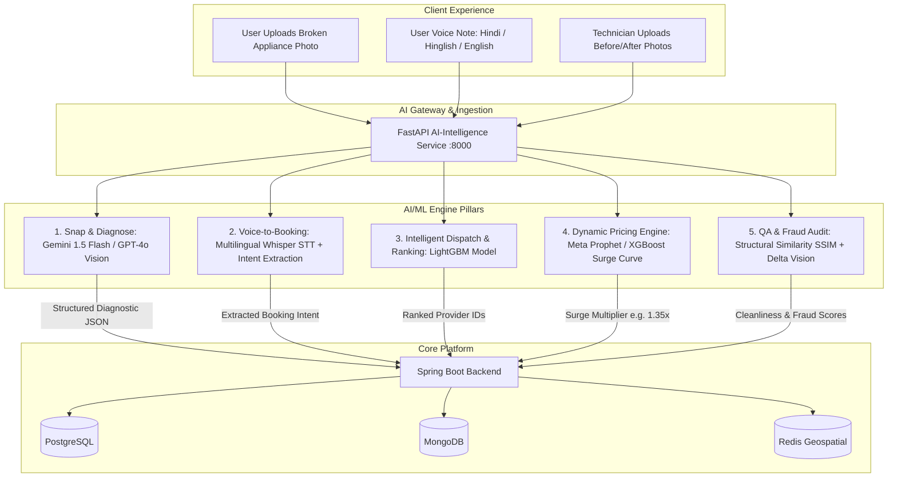
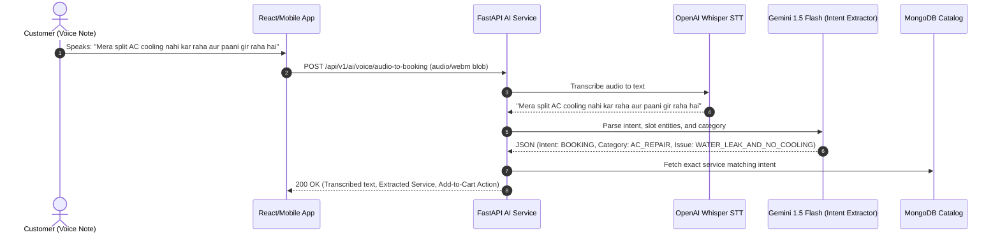

# AI/ML INTEGRATION BLUEPRINT
## Taaskr Enterprise On-Demand Marketplace Platform

---

## 1. AI/ML Strategic Architecture

To match the operational excellence of platforms like Urban Company and Uber, **Taaskr** leverages a hybrid AI architecture combining **Multimodal Generative AI (LLMs/Vision)** with **High-Speed Tabular Machine Learning (LightGBM/XGBoost)** and **Time-Series Forecasting Models**.



---

## 2. Pillar 1: Visual Problem Diagnostic ("Snap & Diagnose")

### 2.1 Overview & Architecture
Customers frequently struggle to explain technical appliance faults (e.g. "PCB short circuit vs. capacitor failure", "AC ice formation vs. drain pipe blockage").
The **Snap & Diagnose** pipeline accepts an uploaded image from the customer, processes it via Multimodal Vision LLMs (Google Gemini 1.5 Flash or OpenAI GPT-4o-mini), and returns a precise technical diagnosis, safety warnings, required tools, and the recommended catalog service code.

### 2.2 System Prompt & Few-Shot Engineering

```python
# prompt_templates.py
SNAP_AND_DIAGNOSE_SYSTEM_PROMPT = """
You are an expert diagnostic master technician for home appliances, electrical systems, plumbing, and carpentry for the on-demand service platform 'Taaskr'.
Analyze the user's uploaded image and provide a highly accurate, structured technical diagnosis in strict JSON format.

RULES:
1. Identify the appliance/fixture and the visible issue (e.g., refrigerant leak, corroded pipe, burned capacitor, drain clog, mold).
2. Determine danger/safety level: 'SAFE', 'MODERATE_HAZARD', 'CRITICAL_HAZARD'.
3. Recommend the exact Taaskr service category and service code from our catalog:
   - AC_REPAIR: ['AC_FOAM_JET_CLEAN', 'AC_GAS_REFILL', 'AC_LEAK_FIX', 'AC_PCB_REPAIR', 'AC_INSTALLATION']
   - PLUMBING: ['TAP_REPAIR', 'PIPE_LEAK_REPAIR', 'DRAIN_UNCLOG', 'WATER_HEATER_FIX']
   - ELECTRICAL: ['SWITCHBOARD_REPLACE', 'SHORT_CIRCUIT_FIX', 'FAN_REPAIR', 'MCB_TRIP_FIX']
   - CLEANING: ['DEEP_KITCHEN_CLEAN', 'BATHROOM_CLEAN', 'SOFA_SHAMPOOING']
4. Output STRICT JSON only. No markdown ticks, no commentary.

JSON Output Schema:
{
  "detected_item": "string",
  "confidence_score": float (0.0 - 1.0),
  "primary_defect": "string",
  "hazard_level": "SAFE" | "MODERATE_HAZARD" | "CRITICAL_HAZARD",
  "customer_explanation": "Simple 2-sentence explanation for the homeowner",
  "recommended_service_code": "string",
  "estimated_price_range_inr": { "min": int, "max": int },
  "estimated_repair_time_minutes": int,
  "technician_notes": ["Required tool 1", "Required part 2"]
}
"""
```

### 2.3 Python / FastAPI Implementation

```python
# services/diagnostic_service.py
import json
import base64
from fastapi import APIRouter, UploadFile, File, Form, HTTPException
import google.generativeai as genai
from pydantic import BaseModel

router = APIRouter(prefix="/api/v1/ai/diagnose", tags=["AI Diagnostic"])
genai.configure(api_key="YOUR_GEMINI_API_KEY")

class DiagnosticResponse(BaseModel):
    detected_item: str
    confidence_score: float
    primary_defect: str
    hazard_level: str
    customer_explanation: str
    recommended_service_code: str
    estimated_price_range_inr: dict
    estimated_repair_time_minutes: int
    technician_notes: list[str]

@router.post("/snap-and-diagnose", response_model=DiagnosticResponse)
async def snap_and_diagnose(
    image: UploadFile = File(...),
    user_description: str = Form(default="")
):
    try:
        image_bytes = await image.read()
        model = genai.GenerativeModel("gemini-1.5-flash")
        
        prompt_parts = [
            SNAP_AND_DIAGNOSE_SYSTEM_PROMPT,
            f"User Additional Context: {user_description}",
            {"mime_type": image.content_type, "data": image_bytes}
        ]
        
        response = model.generate_content(prompt_parts)
        cleaned_text = response.text.strip()
        if cleaned_text.startswith("```json"):
            cleaned_text = cleaned_text[7:-3].strip()
        elif cleaned_text.startswith("```"):
            cleaned_text = cleaned_text[3:-3].strip()
            
        data = json.loads(cleaned_text)
        return DiagnosticResponse(**data)
    except Exception as e:
        raise HTTPException(status_code=500, detail=f"Diagnostic analysis failed: {str(e)}")
```

---

## 3. Pillar 2: Intelligent Provider Dispatch & Ranking Engine (LightGBM)

### 3.1 Feature Engineering Matrix
Instead of naive round-robin dispatch, the ML model computes an optimal **Suitability Match Score** $S \in [0, 1]$ for every candidate technician within the search radius.

```mermaid
flowchart LR
    CandidatePool[Candidate Technicians within 5km] --> FeatureExtraction[Real-time Feature Pipeline]
    
    subgraph Features
        F1[Proximity Distance km]
        F2[Historical Rating 1-5]
        F3[Category Completion Rate %]
        F4[Active Jobs Today]
        F5[Historical Customer Repeat Rate]
        F6[Average Job Duration Deviation]
    end
    
    FeatureExtraction --> Features
    Features --> LightGBM[LightGBM Ranker Model]
    LightGBM --> RankedList[Ranked Candidates 1st, 2nd, 3rd]
    RankedList --> CascadeDispatch[Cascading Lock & Dispatch Strategy]
```



### 3.2 LightGBM Model Architecture & Training Pipeline

```python
# ml/train_dispatch_ranker.py
import numpy as np
import pandas as pd
import lightgbm as lgb
from sklearn.model_selection import train_test_split
import joblib

def generate_synthetic_training_data(n_samples=50000):
    np.random.seed(42)
    distance_km = np.random.uniform(0.5, 12.0, n_samples)
    provider_rating = np.random.uniform(3.5, 5.0, n_samples)
    completion_rate = np.random.uniform(70.0, 100.0, n_samples)
    jobs_done_today = np.random.randint(0, 6, n_samples)
    category_experience_months = np.random.randint(1, 60, n_samples)
    cancellation_history_rate = np.random.uniform(0.0, 0.25, n_samples)
    
    # Target: 1 if accepted & successfully completed without dispute, 0 otherwise
    logits = (
        - 0.45 * distance_km
        + 1.20 * (provider_rating - 4.0)
        + 0.03 * (completion_rate - 85)
        - 0.35 * jobs_done_today
        + 0.02 * category_experience_months
        - 3.50 * cancellation_history_rate
    )
    probabilities = 1 / (1 + np.exp(-logits))
    target = (np.random.rand(n_samples) < probabilities).astype(int)
    
    df = pd.DataFrame({
        'distance_km': distance_km,
        'provider_rating': provider_rating,
        'completion_rate': completion_rate,
        'jobs_done_today': jobs_done_today,
        'category_experience_months': category_experience_months,
        'cancellation_history_rate': cancellation_history_rate,
        'is_successful_match': target
    })
    return df

# Train & Save Model
df = generate_synthetic_training_data()
features = ['distance_km', 'provider_rating', 'completion_rate', 'jobs_done_today', 'category_experience_months', 'cancellation_history_rate']
X = df[features]
y = df['is_successful_match']

X_train, X_val, y_train, y_val = train_test_split(X, y, test_size=0.2, random_state=42)

train_data = lgb.Dataset(X_train, label=y_train)
val_data = lgb.Dataset(X_val, label=y_val, reference=train_data)

params = {
    'objective': 'binary',
    'metric': 'auc',
    'boosting_type': 'gbdt',
    'learning_rate': 0.05,
    'num_leaves': 31,
    'feature_fraction': 0.8,
    'verbose': -1
}

model = lgb.train(params, train_data, num_boost_round=300, valid_sets=[val_data])
joblib.dump(model, "models/dispatch_ranker_lightgbm.pkl")
print("Model trained and exported successfully.")
```

### 3.3 Real-Time Scoring Endpoint

```python
# services/dispatch_service.py
from fastapi import APIRouter
from pydantic import BaseModel
import joblib
import numpy as np

router = APIRouter(prefix="/api/v1/ai/dispatch", tags=["Dispatch Engine"])
model = joblib.load("models/dispatch_ranker_lightgbm.pkl")

class CandidateFeatures(BaseModel):
    provider_id: str
    distance_km: float
    provider_rating: float
    completion_rate: float
    jobs_done_today: int
    category_experience_months: int
    cancellation_history_rate: float

class DispatchRankRequest(BaseModel):
    booking_id: str
    service_code: str
    candidates: list[CandidateFeatures]

class RankedCandidate(BaseModel):
    provider_id: str
    match_score: float

@router.post("/rank-candidates", response_model=list[RankedCandidate])
async def rank_candidates(req: DispatchRankRequest):
    if not req.candidates:
        return []
    
    matrix = np.array([
        [
            c.distance_km,
            c.provider_rating,
            c.completion_rate,
            c.jobs_done_today,
            c.category_experience_months,
            c.cancellation_history_rate
        ] for c in req.candidates
    ])
    
    scores = model.predict(matrix)
    
    ranked = [
        RankedCandidate(provider_id=c.provider_id, match_score=float(score))
        for c, score in zip(req.candidates, scores)
    ]
    ranked.sort(key=lambda x: x.match_score, reverse=True)
    return ranked
```

---

## 4. Pillar 3: Dynamic Pricing & Demand Forecasting Engine

### 4.1 Demand Prediction Curve (Meta Prophet)

During extreme weather conditions (e.g. 44°C summer heatwaves causing AC breakdown spikes) or festive seasons (Diwali deep cleaning rush), demand severely outpaces supply.
The Dynamic Pricing engine balances market liquidity by calculating an hourly surge factor $\alpha \in [1.00, 2.50]$.

$$\text{Surge Multiplier } (\alpha) = 1.0 + \min\left(1.50, \max\left(0, \frac{\text{Predicted Demand} - \text{Active Capacity}}{\text{Active Capacity}}\right) \times K_{\text{elasticity}}\right)$$

```python
# ml/demand_forecaster.py
import pandas as pd
from prophet import Prophet
import joblib

def train_prophet_demand_model(historical_bookings_df: pd.DataFrame, service_category="AC_REPAIR"):
    """
    historical_bookings_df expects columns: ['ds' (datetime), 'y' (booking_volume), 'temperature_celsius', 'is_holiday']
    """
    model = Prophet(yearly_seasonality=True, weekly_seasonality=True, daily_seasonality=True)
    model.add_regressor('temperature_celsius')
    model.add_regressor('is_holiday')
    
    model.fit(historical_bookings_df)
    joblib.dump(model, f"models/prophet_{service_category}.pkl")
    return model
```

### 4.2 Dynamic Pricing Surge Calculator

```python
# services/pricing_service.py
from fastapi import APIRouter
from pydantic import BaseModel

router = APIRouter(prefix="/api/v1/ai/pricing", tags=["Dynamic Pricing"])

class SurgeCalculationRequest(BaseModel):
    service_code: str
    geo_zone_id: str
    current_active_providers: int
    unassigned_bookings: int
    predicted_demand_next_hour: int
    base_price: float

class SurgeCalculationResponse(BaseModel):
    service_code: str
    base_price: float
    surge_multiplier: float
    final_price: float
    surge_reason: str

@router.post("/calculate-surge", response_model=SurgeCalculationResponse)
async def calculate_surge(req: SurgeCalculationRequest):
    capacity = max(1, req.current_active_providers)
    demand = req.unassigned_bookings + (req.predicted_demand_next_hour * 0.5)
    
    demand_supply_ratio = demand / capacity
    
    if demand_supply_ratio > 2.5:
        multiplier = 1.75
        reason = "High demand in your area. Extra charges go directly to incentivize technicians."
    elif demand_supply_ratio > 1.8:
        multiplier = 1.35
        reason = "Surge in service requests nearby."
    elif demand_supply_ratio > 1.2:
        multiplier = 1.15
        reason = "Slightly elevated demand."
    else:
        multiplier = 1.00
        reason = "Standard pricing active."
        
    final_price = round(req.base_price * multiplier, 2)
    
    return SurgeCalculationResponse(
        service_code=req.service_code,
        base_price=req.base_price,
        surge_multiplier=multiplier,
        final_price=final_price,
        surge_reason=reason
    )
```

---

## 5. Pillar 4: Voice-to-Booking Conversational Assistant (Whisper STT)

### 5.1 Multilingual Speech-to-Intent Pipeline
Indian and Southeast Asian marketplaces require seamless understanding of mixed language inputs (e.g., Hindi + English = Hinglish: *"Mera split AC cooling nahi kar raha aur paani gir raha hai"*).



### 5.2 Voice Ingestion Endpoint Code

```python
# services/voice_service.py
import openai
from fastapi import APIRouter, UploadFile, File, HTTPException
import google.generativeai as genai
import json

router = APIRouter(prefix="/api/v1/ai/voice", tags=["Voice Assistant"])

VOICE_INTENT_PROMPT = """
You are an intent parser for the Taaskr home service marketplace.
Convert the transcribed speech (which may be in English, Hindi, or Hinglish) into a booking payload.

Output STRICT JSON:
{
  "transcription": "exact transcription",
  "detected_language": "hi" | "en" | "hinglish",
  "category": "AC_REPAIR" | "PLUMBING" | "ELECTRICAL" | "CLEANING" | "PEST_CONTROL" | "CARPENTRY",
  "service_intent": "string",
  "extracted_parameters": {
    "appliance_type": "string",
    "issue_summary": "string"
  }
}
"""

@router.post("/audio-to-booking")
async def audio_to_booking(audio_file: UploadFile = File(...)):
    try:
        audio_content = await audio_file.read()
        
        # 1. Transcribe with Whisper
        # In production, use OpenAI client or local faster-whisper
        client = openai.OpenAI(api_key="YOUR_OPENAI_KEY")
        transcription_res = client.audio.transcriptions.create(
            model="whisper-1",
            file=(audio_file.filename, audio_content, audio_file.content_type)
        )
        user_text = transcription_res.text
        
        # 2. Extract Intent via LLM
        model = genai.GenerativeModel("gemini-1.5-flash")
        res = model.generate_content([VOICE_INTENT_PROMPT, f"User Input: {user_text}"])
        cleaned = res.text.strip().replace("```json", "").replace("```", "").strip()
        
        return json.loads(cleaned)
    except Exception as e:
        raise HTTPException(status_code=500, detail=f"Voice processing failed: {str(e)}")
```

---

## 6. Pillar 5: Quality Assurance & Fraud Audit Vision AI

### 6.1 Before / After Verification Engine
To prevent technician fraud (e.g. photographing a clean wall, submitting pre-existing internet photos, or skipping cleaning steps), the QA Vision engine analyzes the **Before** and **After** photos before releasing automated wallet payouts.

```python
# services/qa_audit_service.py
from fastapi import APIRouter, UploadFile, File, Form, HTTPException
from skimage.metrics import structural_similarity as ssim
import cv2
import numpy as np
import google.generativeai as genai
import json

router = APIRouter(prefix="/api/v1/ai/qa", tags=["QA & Fraud Audit"])

QA_AUDIT_PROMPT = """
You are a Quality Assurance Auditor for home service jobs.
Compare the BEFORE photo and the AFTER photo submitted by the technician.

Validate:
1. Are both photos showing the EXACT same appliance/room/fixture? (Check background landmarks).
2. Is there clear visual improvement/cleaning/repair demonstrated in the AFTER photo?
3. Is there any evidence of fraud (e.g., photo of a phone screen, stock photo, fake submission)?

Output STRICT JSON:
{
  "is_same_subject": bool,
  "visual_improvement_detected": bool,
  "cleanliness_score_improvement": float (0.0 to 1.0),
  "fraud_likelihood": "LOW" | "MEDIUM" | "HIGH",
  "audit_passed": bool,
  "audit_summary": "string"
}
"""

@router.post("/verify-completion")
async def verify_completion(
    before_image: UploadFile = File(...),
    after_image: UploadFile = File(...),
    service_code: str = Form(...)
):
    try:
        before_bytes = await before_image.read()
        after_bytes = await after_image.read()
        
        # 1. Structural Similarity Check (SSIM)
        nparr_before = np.frombuffer(before_bytes, np.uint8)
        nparr_after = np.frombuffer(after_bytes, np.uint8)
        img_b = cv2.imdecode(nparr_before, cv2.IMREAD_GRAYSCALE)
        img_a = cv2.imdecode(nparr_after, cv2.IMREAD_GRAYSCALE)
        
        img_a_resized = cv2.resize(img_a, (img_b.shape[1], img_b.shape[0]))
        score, _ = ssim(img_b, img_a_resized, full=True)
        
        # 2. Vision LLM Semantic Deep Audit
        model = genai.GenerativeModel("gemini-1.5-flash")
        response = model.generate_content([
            QA_AUDIT_PROMPT,
            f"Service Executed: {service_code}",
            {"mime_type": before_image.content_type, "data": before_bytes},
            {"mime_type": after_image.content_type, "data": after_bytes}
        ])
        
        cleaned = response.text.strip().replace("```json", "").replace("```", "").strip()
        audit_result = json.loads(cleaned)
        audit_result["raw_ssim_similarity"] = float(score)
        
        return audit_result
    except Exception as e:
        raise HTTPException(status_code=500, detail=f"QA Audit error: {str(e)}")
```

---

## 7. Spring Boot Integration Client

### 7.1 WebClient Bridge Service in Spring Boot

```java
// src/main/java/com/taaskr/service/AiIntelligenceClient.java
package com.taaskr.service;

import lombok.RequiredArgsConstructor;
import lombok.extern.slf4j.Slf4j;
import org.springframework.core.io.ByteArrayResource;
import org.springframework.http.MediaType;
import org.springframework.http.client.MultipartBodyBuilder;
import org.springframework.stereotype.Service;
import org.springframework.web.reactive.function.BodyInserters;
import org.springframework.web.reactive.function.client.WebClient;

import java.util.Map;

@Slf4j
@Service
@RequiredArgsConstructor
public class AiIntelligenceClient {

    private final WebClient.Builder webClientBuilder;
    private static final String AI_SERVICE_BASE_URL = "http://ai-intelligence-service:8000";

    public Map<String, Object> snapAndDiagnose(byte[] imageBytes, String filename, String userContext) {
        WebClient client = webClientBuilder.baseUrl(AI_SERVICE_BASE_URL).build();
        
        MultipartBodyBuilder builder = new MultipartBodyBuilder();
        builder.part("image", new ByteArrayResource(imageBytes) {
            @Override
            public String getFilename() {
                return filename;
            }
        }).contentType(MediaType.IMAGE_JPEG);
        builder.part("user_description", userContext);

        return client.post()
                .uri("/api/v1/ai/diagnose/snap-and-diagnose")
                .contentType(MediaType.MULTIPART_FORM_DATA)
                .body(BodyInserters.fromMultipartData(builder.build()))
                .retrieve()
                .bodyToMono(Map.class)
                .block();
    }

    public Map<String, Object> verifyServiceProof(byte[] beforeBytes, byte[] afterBytes, String serviceCode) {
        WebClient client = webClientBuilder.baseUrl(AI_SERVICE_BASE_URL).build();

        MultipartBodyBuilder builder = new MultipartBodyBuilder();
        builder.part("before_image", new ByteArrayResource(beforeBytes) {
            @Override
            public String getFilename() { return "before.jpg"; }
        }).contentType(MediaType.IMAGE_JPEG);
        
        builder.part("after_image", new ByteArrayResource(afterBytes) {
            @Override
            public String getFilename() { return "after.jpg"; }
        }).contentType(MediaType.IMAGE_JPEG);
        
        builder.part("service_code", serviceCode);

        return client.post()
                .uri("/api/v1/ai/qa/verify-completion")
                .contentType(MediaType.MULTIPART_FORM_DATA)
                .body(BodyInserters.fromMultipartData(builder.build()))
                .retrieve()
                .bodyToMono(Map.class)
                .block();
    }
}
```
