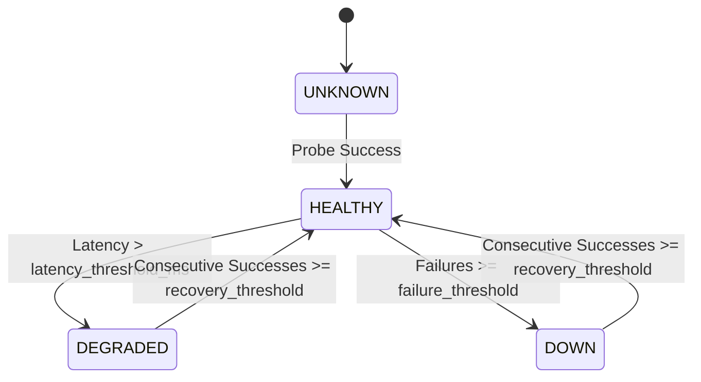

# AI & Observability Architecture: Taaskr Home Services Platform

---

## 1. Executive Summary

Taaskr incorporates an automated AI-driven observability and system diagnostic platform. The AI engine continuously monitors platform endpoint health, captures runtime failures, parses exception tracebacks, and generates structured root-cause diagnostic reports with recommended resolution steps using Google Gemini and OpenAI Large Language Model APIs.

```
┌─────────────────────────────────────────────────────────────────────────┐
│                    Taaskr Backend Monolith Engine                       │
├────────────────────────────────────┬────────────────────────────────────┤
│   Monitored Endpoint Health Probes │   AI Diagnostic Engine             │
│   (Database Probe Loop)            │   (AiDiagnosticServiceImpl.java)   │
└─────────────────┬──────────────────┴─────────────────┬──────────────────┘
                  │                                    │
                  ▼                                    ▼
┌────────────────────────────────────┐┌───────────────────────────────────┐
│ Observability Database Tables      ││ External LLM APIs                 │
│ - monitored_endpoints              ││ - Google Gemini API (gemini-1.5)  │
│ - health_check_results             ││ - OpenAI API (gpt-4o)             │
│ - system_alerts                    │└───────────────────────────────────┘
└────────────────────────────────────┘
```

---

## 2. LLM Engine Integration & Fallback Strategy

The core AI engine is implemented in [`AiDiagnosticServiceImpl.java`](file:///c:/Users/DELL/Desktop/Taaskr/taaskr-backend/src/main/java/com/taaskr/service/impl/AiDiagnosticServiceImpl.java). It provides dynamic multi-provider LLM failover:

```
                          AI PROVIDER FAILOVER FLOW
                                      │
                         ┌────────────▼────────────┐
                         │ Check GEMINI_API_KEY    │
                         └────────────┬────────────┘
                                      │
                     ┌────────────────┴────────────────┐
                     │ Key Present?                    │
                     ├─────────────────┬───────────────┤
                     │ YES             │ NO            │
                     ▼                 ▼               │
            ┌─────────────────┐ ┌──────────────────┐   │
            │ Call Google     │ │ Check            │   │
            │ Gemini REST API │ │ OPENAI_API_KEY   │   │
            └────────┬────────┘ └────────┬─────────┘   │
                     │                   │             │
                     │                   ▼             │
                     │          ┌──────────────────┐   │
                     │          │ Call OpenAI      │   │
                     │          │ Chat REST API    │   │
                     │          └────────┬─────────┘   │
                     │                   │             │
                     ▼                   ▼             ▼
          ┌──────────────────────────────────────────────┐
          │ Fallback Rule-Based Heuristic Engine (If key │
          │ missing or network timeout occurs)           │
          └──────────────────────────────────────────────┘
```

### Configuration Tokens (`application.properties`)
```properties
# AI / ML Large Language Model Engine Keys
gemini.api.key=${GEMINI_API_KEY:}
openai.api.key=${OPENAI_API_KEY:}
```

---

## 3. Database-Driven Observability & Probe Engine

The AI diagnostic platform builds upon 3 specialized database tables managed by [`DatabaseSchemaMigrationRunner.java`](file:///c:/Users/DELL/Desktop/Taaskr/taaskr-backend/src/main/java/com/taaskr/config/DatabaseSchemaMigrationRunner.java#L31-L60):

```
┌───────────────────────────┐
│    monitored_endpoints    │  (Defines target HTTP endpoints, timeout_ms, threshold limits)
└─────────────┬─────────────┘
              │ 1:N
┌─────────────▼─────────────┐
│   health_check_results    │  (Records latency_ms, status_code, failure_reason)
└─────────────┬─────────────┘
              │ 1:N
┌─────────────▼─────────────┐
│       system_alerts       │  (Stores AI diagnostic summaries & remediation steps)
└───────────────────────────┘
```

### Endpoint Probe State Machine

Each monitored HTTP endpoint transitions across states based on consecutive probe results:



---

## 4. Prompt Engineering & Context Synthesis

When an endpoint probe triggers an alert or an administrator requests diagnostic analysis on a stack trace via `AiController.java`, `AiDiagnosticServiceImpl` synthesizes system context into a structured prompt:

### System Prompt Template
```
You are Taaskr AI System Health Architect. 
Analyze the provided system alert and stack trace below.
Output a JSON response containing:
1. "summary": A concise overview of the failure cause.
2. "rootCause": Root cause analysis citing likely database/network/code bottlenecks.
3. "remediationSteps": Array of step-by-step actionable resolution instructions.
4. "severity": "HIGH" | "MEDIUM" | "LOW".

Context:
- Endpoint URL: {urlPath}
- HTTP Status Code: {lastStatusCode}
- Response Time: {lastResponseTimeMs} ms
- Consecutive Failures: {consecutiveFailures}
- Error Log / Stack Trace: {errorMessage}
```

---

## 5. REST API Interface (`AiController.java`)

Administrators interact with the AI diagnostic engine via dedicated endpoints secured with `@PreAuthorize("hasRole('ADMIN')")`:

| Endpoint URL | Method | Auth Role | Description |
| :--- | :--- | :--- | :--- |
| `/api/admin/ai/diagnose` | `POST` | `ADMIN` | Submits raw stack traces or error logs for instant LLM diagnostic analysis. |
| `/api/admin/ai/alerts/{alertId}/analyze` | `POST` | `ADMIN` | Runs deep AI diagnosis on a specific database `SystemAlert` record. |
| `/api/admin/ai/endpoints` | `GET` | `ADMIN` | Lists monitored endpoints with current state and AI diagnostic summaries. |
| `/api/public/health/live` | `GET` | `PUBLIC` | Exposes lightweight probe status for Prometheus scrapers and load balancers. |
