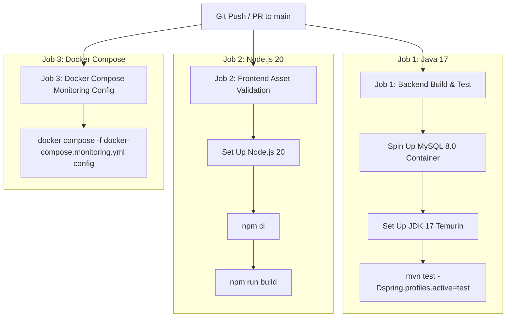

# Cloud & DevOps Architecture: Taaskr Home Services Platform

---

## 1. Executive Summary

Taaskr’s Cloud & DevOps architecture provides containerized deployment, automated CI/CD testing, geospatial road network routing, and full-stack observability.

```
                                  CLOUD & DEVOPS TOPOLOGY
                                            │
           ┌────────────────────────────────┼────────────────────────────────┐
           │                                │                                │
┌──────────▼──────────┐         ┌───────────▼───────────┐        ┌───────────▼───────────┐
│ Dockerized Backend  │         │ Self-Hosted OSRM Engine│        │ Observability Stack   │
│ (Eclipse Temurin 17)│         │ (osrm/osrm-backend)   │        │ (Prometheus & Grafana)│
└──────────┬──────────┘         └───────────┬───────────┘        └───────────┬───────────┘
           │                                │                                │
           └────────────────────────────────┼────────────────────────────────┘
                                            │
                               ┌────────────▼────────────┐
                               │ GitHub Actions Pipeline │
                               │ (ci-cd-observability)   │
                               └─────────────────────────┘
```

---

## 2. Containerization Strategy (`Dockerfile`)

The backend monolith is packaged using a multi-stage `Dockerfile` based on OpenJDK / Eclipse Temurin 17 JRE:

```dockerfile
# Stage 1: Maven Build
FROM eclipse-temurin:17-jdk AS build
WORKDIR /build
COPY .mvn .mvn
COPY mvnw pom.xml ./
RUN chmod +x mvnw && ./mvnw -B dependency:go-offline
COPY src src
RUN ./mvnw -B -DskipTests package

# Stage 2: Runtime JRE Container
FROM eclipse-temurin:17-jre
WORKDIR /app
COPY --from=build /build/target/*.jar app.jar
ENV JAVA_OPTS="-XX:+UseSerialGC -Xms64m -Xmx320m -XX:MaxMetaspaceSize=128m -XX:+ExitOnOutOfMemoryError"
EXPOSE 8081
ENTRYPOINT ["sh", "-c", "java $JAVA_OPTS -jar app.jar"]
```

### JVM Performance Tuning Highlights
* **`-XX:+UseSerialGC`**: Reduces memory overhead for cost-efficient container instances.
* **`-Xms64m -Xmx320m`**: Restricts heap memory footprint between 64MB and 320MB.
* **`-XX:+ExitOnOutOfMemoryError`**: Forces container crash on OOM so orchestrators (Kubernetes / ECS) immediately recycle unhealthy instances.

---

## 3. OSRM Road Routing Engine Container (`docker-compose.osrm.yml`)

Geospatial road routing, distance calculation, and ETA matrix computations are offloaded to a dedicated Open Source Routing Machine (OSRM) container:

```yaml
version: '3.8'

services:
  osrm:
    image: osrm/osrm-backend:v5.27.1
    container_name: taaskr-osrm
    restart: unless-stopped
    ports:
      - "5000:5000"
    volumes:
      - ./osrm-data:/data
    command: osrm-routed --algorithm mld /data/india-latest.osrm
```

* **Integration Point:** Injected into Spring Boot via [`OsrmRoutingServiceImpl.java`](file:///c:/Users/DELL/Desktop/Taaskr/taaskr-backend/src/main/java/com/taaskr/service/impl/OsrmRoutingServiceImpl.java) configured via property `taaskr.routing.osrm.base-url=http://localhost:5000`.

---

## 4. Monitoring & Observability Stack (`docker-compose.monitoring.yml`)

System metrics and HTTP endpoint latencies are monitored using Prometheus and Grafana:

```
┌─────────────────────────────────┐
│ Taaskr Spring Boot Monolith     │
│ (/actuator/prometheus)          │
└────────────────┬────────────────┘
                 │ (Scrape Every 15s)
┌────────────────▼────────────────┐
│ Prometheus Server (Port 9090)   │
└────────────────┬────────────────┘
                 │ (Data Source)
┌────────────────▼────────────────┐
│ Grafana Dashboards (Port 3000)  │
└─────────────────────────────────┘
```

### Prometheus Config snippet (`monitoring/prometheus.yml`)
```yaml
global:
  scrape_interval: 15s

scrape_configs:
  - job_name: 'taaskr-backend'
    metrics_path: '/actuator/prometheus'
    static_configs:
      - targets: ['host.docker.internal:8081']
```

---

## 5. Automated CI/CD Pipeline (`.github/workflows/ci-cd-observability.yml`)

The repository includes an automated GitHub Actions pipeline executing on push or pull requests to `main`:



---

## 6. Environment Configurations Strategy

| Environment | Active Spring Profile | Database Source | Demo Data Seeding | Email / SMS Mode |
| :--- | :--- | :--- | :--- | :--- |
| **Local Dev** | `local` | H2 File (`jdbc:h2:file:./data/taaskr_dev`) | `true` (`app.seed.demo-data=true`) | Simulation Mode (`true`) |
| **Test / CI** | `test` | Ephemeral MySQL 8.0 container | `true` | Simulation Mode (`true`) |
| **Production** | `prod` | Aiven Managed MySQL (SSL Required) | `false` | Real APIs (Brevo/Twilio) |
