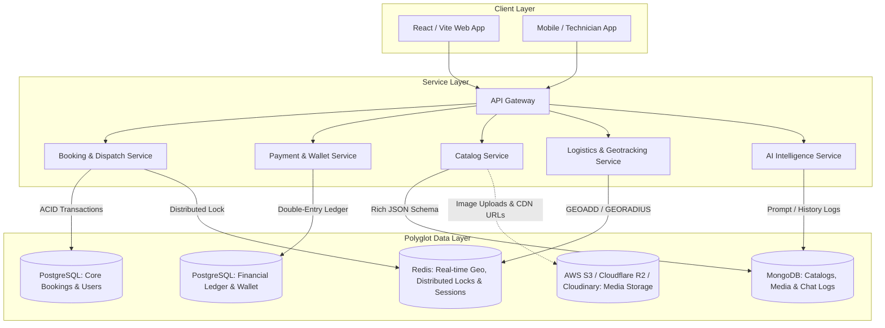
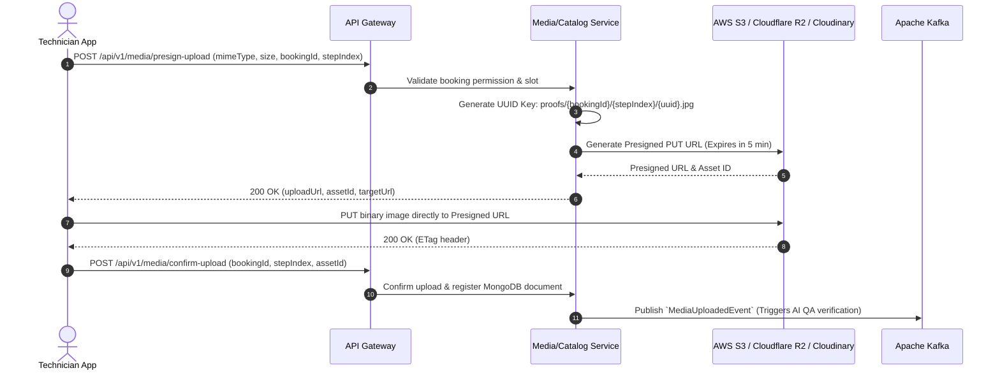
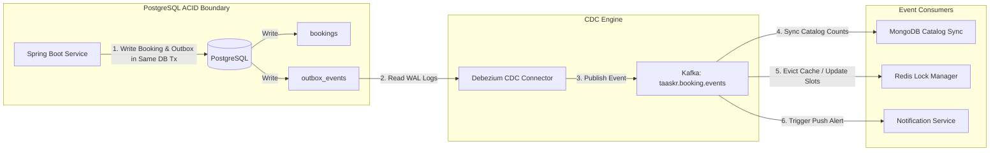

# DATABASE ARCHITECTURE & POLYGLOT PERSISTENCE GUIDE
## Taaskr On-Demand Marketplace Platform

---

## 1. Polyglot Persistence Overview & Workload Allocation

Modern on-demand doorstep service platforms encounter vastly diverse access patterns and data lifecycles. A single monolithic relational database quickly faces I/O bottlenecks when high-throughput real-time GPS coordinates, semi-structured dynamic catalog attributes, high-resolution before/after media records, and mission-critical financial ledgers compete for identical buffer pools and write locks.

Taaskr adopts a **Polyglot Persistence Architecture** where each data store is selected specifically for its workload profile:



### Storage Engine Allocation Matrix

| Data Domain | Storage Engine | Access Pattern | Consistency Model | Why This Engine? |
| :--- | :--- | :--- | :--- | :--- |
| **Bookings, Users, Disputes** | PostgreSQL (Relational) | High Read/Write, Complex Joins, Foreign Keys | Strict ACID | Strict schema validation, referential integrity, relational queries across customers and providers. |
| **Financial Ledgers & Wallets** | PostgreSQL (Relational) | Append-only Writes, Financial Auditing | Strict ACID, Serialized | Zero-tolerance for lost updates or balance calculation drifts. Double-entry transaction constraints. |
| **Dynamic Catalogs & Taxonomies** | MongoDB (Document Store) | Read-heavy, Polymorphic Documents | Tunable / Eventual | Flexible attributes per service category (e.g., AC tonnage vs. Pest control chemicals). |
| **Before/After Media & Step Photos** | MongoDB + Object Storage | Write-once, Read-heavy | Eventual | Rich JSON metadata referencing multi-CDN URLs and verification tags. |
| **Real-Time GPS Coordinates** | Redis (In-Memory Key-Value) | Extreme Write (every 3s per driver), Read Proximity | Transient / Volatile | `GEOADD` and `GEORADIUS` execute in $O(N + \log M)$ time in RAM without disk I/O penalties. |
| **Active Slot Locking & Rate Limits** | Redis (In-Memory) | High Throughput, TTL Expiration | Strong In-Memory | Atomic `SET key NX EX` prevents double-booking time slots during checkout. |
| **High-Res Photos, Invoices & PDFs** | Cloudinary / AWS S3 / Cloudflare R2 | Blob Storage via Presigned URLs | High Availability | S3 cost-efficiency, global edge caching, and offloading heavy binary streams from backend servers. |

---

## 2. PostgreSQL (Relational/ACID) Schema & DDL Design

The relational database handles core entities requiring strict relational constraints and immutable auditability.

### 2.1 Core Relational DDL (Bookings, Disputes, Payouts & Ledgers)

```sql
-- Enable UUID extension and PostGIS (for spatial fallback queries)
CREATE EXTENSION IF NOT EXISTS "uuid-ossp";
CREATE EXTENSION IF NOT EXISTS "pgcrypto";

-- ==========================================
-- 1. USERS & PROFILES TABLE
-- ==========================================
CREATE TABLE users (
    id UUID PRIMARY KEY DEFAULT gen_random_uuid(),
    email VARCHAR(255) UNIQUE NOT NULL,
    phone_number VARCHAR(20) UNIQUE NOT NULL,
    password_hash VARCHAR(255) NOT NULL,
    first_name VARCHAR(100) NOT NULL,
    last_name VARCHAR(100) NOT NULL,
    role VARCHAR(30) NOT NULL CHECK (role IN ('ROLE_CUSTOMER', 'ROLE_PROVIDER', 'ROLE_ADMIN', 'ROLE_SUPPORT')),
    is_active BOOLEAN DEFAULT TRUE NOT NULL,
    is_verified BOOLEAN DEFAULT FALSE NOT NULL,
    created_at TIMESTAMPTZ DEFAULT CURRENT_TIMESTAMP NOT NULL,
    updated_at TIMESTAMPTZ DEFAULT CURRENT_TIMESTAMP NOT NULL
);

CREATE INDEX idx_users_phone ON users(phone_number);
CREATE INDEX idx_users_email ON users(email);

-- ==========================================
-- 2. PROVIDER PROFILES & METRICS
-- ==========================================
CREATE TABLE provider_profiles (
    id UUID PRIMARY KEY DEFAULT gen_random_uuid(),
    user_id UUID UNIQUE NOT NULL REFERENCES users(id) ON DELETE RESTRICT,
    category_code VARCHAR(50) NOT NULL,
    rating_avg NUMERIC(3, 2) DEFAULT 5.00 NOT NULL CHECK (rating_avg >= 1.00 AND rating_avg <= 5.00),
    total_reviews INT DEFAULT 0 NOT NULL,
    completion_rate NUMERIC(5, 2) DEFAULT 100.00 NOT NULL,
    is_online BOOLEAN DEFAULT FALSE NOT NULL,
    kyc_status VARCHAR(30) DEFAULT 'PENDING' NOT NULL CHECK (kyc_status IN ('PENDING', 'VERIFIED', 'REJECTED')),
    created_at TIMESTAMPTZ DEFAULT CURRENT_TIMESTAMP NOT NULL,
    updated_at TIMESTAMPTZ DEFAULT CURRENT_TIMESTAMP NOT NULL
);

CREATE INDEX idx_provider_cat_online ON provider_profiles(category_code, is_online) WHERE is_online = TRUE;

-- ==========================================
-- 3. BOOKINGS TABLE (ACID Core)
-- ==========================================
CREATE TABLE bookings (
    id UUID PRIMARY KEY DEFAULT gen_random_uuid(),
    booking_reference VARCHAR(32) UNIQUE NOT NULL,
    customer_id UUID NOT NULL REFERENCES users(id) ON DELETE RESTRICT,
    provider_id UUID REFERENCES users(id) ON DELETE RESTRICT,
    service_id VARCHAR(64) NOT NULL, -- Logical ID linking to MongoDB catalog
    status VARCHAR(40) NOT NULL CHECK (
        status IN ('PENDING_PAYMENT', 'SEARCHING_PROVIDER', 'ASSIGNED', 'IN_TRANSIT', 'IN_PROGRESS', 'COMPLETED', 'CANCELLED', 'REFUNDED')
    ),
    scheduled_at TIMESTAMPTZ NOT NULL,
    address_line TEXT NOT NULL,
    latitude NUMERIC(9, 6) NOT NULL,
    longitude NUMERIC(9, 6) NOT NULL,
    total_amount NUMERIC(12, 2) NOT NULL CHECK (total_amount >= 0),
    surge_multiplier NUMERIC(3, 2) DEFAULT 1.00 NOT NULL,
    cancellation_reason TEXT,
    created_at TIMESTAMPTZ DEFAULT CURRENT_TIMESTAMP NOT NULL,
    updated_at TIMESTAMPTZ DEFAULT CURRENT_TIMESTAMP NOT NULL
);

-- B-Tree & Composite Indexes for high-frequency queries
CREATE INDEX idx_bookings_customer_status ON bookings(customer_id, status);
CREATE INDEX idx_bookings_provider_status ON bookings(provider_id, status);
CREATE INDEX idx_bookings_scheduled_at ON bookings(scheduled_at);
CREATE INDEX idx_bookings_created_at_brin ON bookings USING BRIN (created_at);

-- ==========================================
-- 4. DOUBLE-ENTRY FINANCIAL WALLET & LEDGER
-- ==========================================
CREATE TABLE wallets (
    id UUID PRIMARY KEY DEFAULT gen_random_uuid(),
    user_id UUID UNIQUE NOT NULL REFERENCES users(id) ON DELETE RESTRICT,
    currency VARCHAR(3) DEFAULT 'INR' NOT NULL,
    balance NUMERIC(14, 2) DEFAULT 0.00 NOT NULL CHECK (balance >= 0.00),
    locked_balance NUMERIC(14, 2) DEFAULT 0.00 NOT NULL CHECK (locked_balance >= 0.00),
    version BIGINT DEFAULT 0 NOT NULL, -- Optimistic locking
    updated_at TIMESTAMPTZ DEFAULT CURRENT_TIMESTAMP NOT NULL
);

CREATE TABLE wallet_transactions (
    id UUID PRIMARY KEY DEFAULT gen_random_uuid(),
    wallet_id UUID NOT NULL REFERENCES wallets(id) ON DELETE RESTRICT,
    booking_id UUID REFERENCES bookings(id) ON DELETE SET NULL,
    transaction_type VARCHAR(30) NOT NULL CHECK (
        transaction_type IN ('HOLD', 'CAPTURE', 'RELEASE', 'CREDIT', 'DEBIT', 'PAYOUT', 'REFUND')
    ),
    amount NUMERIC(14, 2) NOT NULL,
    running_balance NUMERIC(14, 2) NOT NULL,
    reference_id VARCHAR(100) NOT NULL,
    created_at TIMESTAMPTZ DEFAULT CURRENT_TIMESTAMP NOT NULL
);

CREATE INDEX idx_wallet_tx_wallet_date ON wallet_transactions(wallet_id, created_at DESC);

-- ==========================================
-- 5. DISPUTES & RESOLUTIONS TABLE
-- ==========================================
CREATE TABLE disputes (
    id UUID PRIMARY KEY DEFAULT gen_random_uuid(),
    booking_id UUID UNIQUE NOT NULL REFERENCES bookings(id) ON DELETE RESTRICT,
    raised_by_id UUID NOT NULL REFERENCES users(id) ON DELETE RESTRICT,
    dispute_category VARCHAR(50) NOT NULL,
    description TEXT NOT NULL,
    status VARCHAR(30) DEFAULT 'OPEN' NOT NULL CHECK (status IN ('OPEN', 'INVESTIGATING', 'RESOLVED', 'REJECTED')),
    resolution_type VARCHAR(50) CHECK (resolution_type IN ('FULL_REFUND', 'PARTIAL_REFUND', 'FREE_REVISIT', 'NO_ACTION')),
    refund_amount NUMERIC(12, 2) DEFAULT 0.00,
    created_at TIMESTAMPTZ DEFAULT CURRENT_TIMESTAMP NOT NULL,
    resolved_at TIMESTAMPTZ
);

-- ==========================================
-- 6. TRANSACTIONAL OUTBOX TABLE (CDC / Kafka)
-- ==========================================
CREATE TABLE outbox_events (
    id UUID PRIMARY KEY DEFAULT gen_random_uuid(),
    aggregate_type VARCHAR(100) NOT NULL,
    aggregate_id VARCHAR(100) NOT NULL,
    event_type VARCHAR(100) NOT NULL,
    payload JSONB NOT NULL,
    created_at TIMESTAMPTZ DEFAULT CURRENT_TIMESTAMP NOT NULL,
    processed_at TIMESTAMPTZ
);

CREATE INDEX idx_outbox_unprocessed ON outbox_events(created_at) WHERE processed_at IS NULL;
```

---

## 3. MongoDB (Document Store) Schema Design

Semi-structured, nested, and polymorphous data (e.g., service checklists, inspection equipment, AI chat threads, multi-photo verification steps) live in MongoDB for extreme schema agility and horizontal sharding.

### 3.1 Collection: `service_catalogs`
```json
{
  "$jsonSchema": {
    "bsonType": "object",
    "required": ["code", "name", "category", "basePrice", "estimatedMinutes", "isActive"],
    "properties": {
      "_id": { "bsonType": "objectId" },
      "code": { "bsonType": "string", "description": "Unique code e.g. AC_FOAM_JET_SERVICE" },
      "name": { "bsonType": "string" },
      "category": { "bsonType": "string", "enum": ["AC_REPAIR", "PLUMBING", "ELECTRICAL", "CLEANING", "PEST_CONTROL", "CARPENTRY", "LOGISTICS"] },
      "basePrice": { "bsonType": "decimal" },
      "taxRatePercentage": { "bsonType": "decimal" },
      "estimatedMinutes": { "bsonType": "int" },
      "isActive": { "bsonType": "bool" },
      "parameters": {
        "bsonType": "object",
        "description": "Category-specific polymorphic metadata",
        "properties": {
          "applicableAppliances": { "bsonType": "array", "items": { "bsonType": "string" } },
          "warrantyDays": { "bsonType": "int" },
          "toolsRequired": { "bsonType": "array", "items": { "bsonType": "string" } },
          "serviceChecklist": {
            "bsonType": "array",
            "items": {
              "bsonType": "object",
              "required": ["stepIndex", "stepTitle", "requiresPhotoProof"],
              "properties": {
                "stepIndex": { "bsonType": "int" },
                "stepTitle": { "bsonType": "string" },
                "requiresPhotoProof": { "bsonType": "bool" }
              }
            }
          }
        }
      },
      "media": {
        "thumbnailUrl": { "bsonType": "string" },
        "bannerUrl": { "bsonType": "string" },
        "videoExplainerUrl": { "bsonType": "string" }
      },
      "createdAt": { "bsonType": "date" },
      "updatedAt": { "bsonType": "date" }
    }
  }
}
```

### 3.2 Collection: `service_media_galleries` (Before / After Proofs)
```json
{
  "_id": "66dec98f12a4b89123456789",
  "bookingId": "a1b2c3d4-e5f6-7890-abcd-ef1234567890",
  "providerId": "98765432-abcd-ef01-2345-6789abcdef01",
  "serviceCode": "AC_DEEP_CLEAN",
  "workflowSteps": [
    {
      "stepIndex": 1,
      "stepTitle": "Initial AC Coil Inspection",
      "status": "COMPLETED",
      "timestamp": "2026-09-10T09:15:30Z",
      "beforePhoto": {
        "assetId": "cld_ac_before_01",
        "url": "https://res.cloudinary.com/taaskr/image/upload/v1725960000/proofs/ac_before_01.jpg",
        "thumbnailUrl": "https://res.cloudinary.com/taaskr/image/upload/w_200,h_200,c_fill/proofs/ac_before_01.jpg",
        "metadata": { "width": 1920, "height": 1080, "fileSize": 1240392, "gps": { "lat": 19.0760, "lng": 72.8777 } }
      },
      "afterPhoto": {
        "assetId": "cld_ac_after_01",
        "url": "https://res.cloudinary.com/taaskr/image/upload/v1725963600/proofs/ac_after_01.jpg",
        "thumbnailUrl": "https://res.cloudinary.com/taaskr/image/upload/w_200,h_200,c_fill/proofs/ac_after_01.jpg",
        "metadata": { "width": 1920, "height": 1080, "fileSize": 1109482, "gps": { "lat": 19.0760, "lng": 72.8777 } }
      },
      "aiVerification": {
        "isVerified": true,
        "cleanlinessDeltaScore": 0.94,
        "fraudScore": 0.02,
        "verifiedAt": "2026-09-10T10:05:00Z"
      }
    }
  ],
  "createdAt": "2026-09-10T09:10:00Z"
}
```

### 3.3 Collection: `ai_chat_sessions`
```json
{
  "_id": "66dec98f98a7b6543210fedc",
  "userId": "12345678-abcd-1234-abcd-123456789abc",
  "sessionId": "sess_88921b34",
  "context": {
    "intent": "SNAP_AND_DIAGNOSE",
    "detectedAppliance": "SPLIT_AC_INDOOR_UNIT",
    "detectedIssue": "WATER_LEAKAGE_DRAIN_PIPE_CLOG"
  },
  "messages": [
    {
      "sender": "USER",
      "contentType": "IMAGE_AND_TEXT",
      "imageUrl": "https://res.cloudinary.com/taaskr/image/upload/diagnostics/leak_sample.jpg",
      "text": "My AC is dropping water continuously on my bed",
      "timestamp": "2026-09-10T08:30:00Z"
    },
    {
      "sender": "AI_ASSISTANT",
      "contentType": "TEXT_WITH_ACTIONS",
      "text": "Based on the image and your description, the AC condensate drain pipe appears blocked with dust slurry. I recommend an AC Foam Jet Cleaning service.",
      "recommendedServices": ["AC_FOAM_JET_SERVICE"],
      "estimatedCostRange": { "min": 599.00, "max": 799.00 },
      "timestamp": "2026-09-10T08:30:02Z"
    }
  ]
}
```

---

## 4. Redis (In-Memory & Geolocation) Operations

Redis operates as an ultra-fast cache, distributed coordinate broker, and concurrency mutex.

### 4.1 Real-Time Geolocation Tracking (`GEOADD` & `GEORADIUS`)

When technicians broadcast their live GPS locations every 3–5 seconds:

```bash
# 1. Update technician GPS coordinates (Key partitioned by category)
# Syntax: GEOADD key longitude latitude member
GEOADD "geo:providers:AC_REPAIR" 72.877426 19.076090 "provider:usr_9981"
GEOADD "geo:providers:AC_REPAIR" 72.881230 19.079450 "provider:usr_9982"
GEOADD "geo:providers:PLUMBING" 72.865400 19.071200 "provider:usr_4412"

# 2. Query all available AC Repair technicians within 5 km radius of user (lat: 19.0759, lng: 72.8770)
# Returns member names, distance in km, and coordinates
GEORADIUS "geo:providers:AC_REPAIR" 72.8770 19.0759 5 km WITHDIST WITHCOORD ASC COUNT 10

# 3. Store provider metadata & active status with short TTL (Heartbeat)
HSET "provider:status:usr_9981" "battery" "87" "status" "AVAILABLE" "lastPing" "1725960000"
EXPIRE "provider:status:usr_9981" 30
```

### 4.2 Distributed Booking Slot Locking (Preventing Double-Booking)

```bash
# Acquire a lock for a provider's specific time slot (TTL: 180 seconds during checkout)
# Syntax: SET key value NX EX seconds
SET "lock:provider:usr_9981:slot:2026-09-10T14:00:00Z" "booking_ref_tx991" NX EX 180

# Response if acquired: "OK"
# Response if already locked by another customer: (nil) -> Reject / show "Slot Selected"
```

Lua Script for Atomic Lock Release:
```lua
-- Safe unlock ensuring only the lock owner deletes the key
if redis.call("get", KEYS[1]) == ARGV[1] then
    return redis.call("del", KEYS[1])
else
    return 0
end
```

---

## 5. Media & Storage Architecture (Cloudinary / AWS S3)

High-resolution photos from customers (diagnostics) and providers (before/after work verification) must **never stream directly through backend application memory**.

### 5.1 Direct-to-Storage Presigned Upload Pipeline



---

## 6. Data Consistency Across Polyglot Engines

When a single transaction spans relational PostgreSQL records, MongoDB galleries, and Redis geo-caches, distributed consistency is preserved using the **Transactional Outbox Pattern** with Kafka and CDC (Change Data Capture).



### 6.1 PostgreSQL Connection Pooling & PgBouncer Configuration

For high concurrent throughput without exhausting PostgreSQL's process memory:

```ini
# pgbouncer.ini
[databases]
taaskr_core = host=127.0.0.1 port=5432 dbname=taaskr_core_db pool_size=50

[pgbouncer]
listen_port = 6432
listen_addr = 0.0.0.0
auth_type = scram-sha-256
auth_file = /etc/pgbouncer/userlist.txt
pool_mode = transaction
max_client_conn = 5000
default_pool_size = 40
min_pool_size = 10
reserve_pool_size = 5
reserve_pool_timeout = 5
server_idle_timeout = 60
```

### 6.2 Spring Boot HikariCP Optimized Configuration

```properties
# application-production.properties
spring.datasource.url=jdbc:postgresql://localhost:6432/taaskr_core_db?sslmode=require&prepareThreshold=0
spring.datasource.username=taaskr_app
spring.datasource.password=${DB_PASSWORD}
spring.datasource.driver-class-name=org.postgresql.Driver

# HikariCP Tuning
spring.datasource.hikari.maximum-pool-size=30
spring.datasource.hikari.minimum-idle=10
spring.datasource.hikari.idle-timeout=30000
spring.datasource.hikari.max-lifetime=1800000
spring.datasource.hikari.connection-timeout=20000
spring.datasource.hikari.leak-detection-threshold=10000
spring.datasource.hikari.pool-name=TaaskrCoreHikariPool
```
