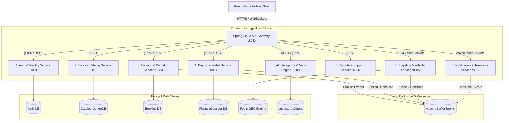
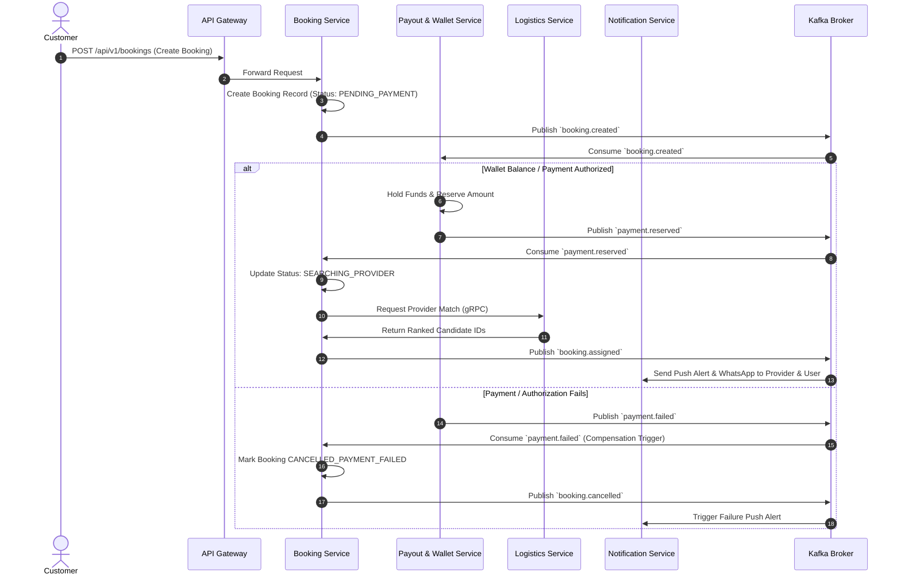

# Taaskr Monolith to Microservices Architecture Decomposition Master Roadmap
**Author:** Antigravity Architecture Team  
**System Target:** Enterprise On-Demand Marketplace Platform (Taaskr)  
**Status:** Approved Technical Migration Blueprint  

---

## 1. Architectural Vision & Topology Overview

Currently, **Taaskr** operates as a modular Spring Boot monolith with a PostgreSQL/MySQL database. To scale to 100,000+ daily active bookings, multi-city real-time vehicle dispatch, and sub-second AI diagnostics, the platform will be decomposed into **8 specialized microservices**, governed by an **API Gateway** and an **Apache Kafka Event Backbone**.



---

## 2. Exhaustive Microservice Decomposition & Method Mapping

Every single controller endpoint, service implementation method, entity model, and repository query from the monolith is mapped to its target microservice below.

---

### Service 1: `auth-identity-service` (Port 8081)
- **Bounded Context:** User Registration, Authentication, Password Reset, OTP Verification, KYC Audit, and Role Management.
- **Database:** `taaskr_auth_db` (PostgreSQL / MySQL)
- **Entities:** `User`, `Role`, `ProviderProfile`, `KycDocument`, `Address`

#### API Endpoints & Mapped Methods
1. `POST /api/v1/auth/register` $\rightarrow$ `AuthService.registerUser(RegisterRequest)`
2. `POST /api/v1/auth/login` $\rightarrow$ `AuthService.loginUser(LoginRequest)`
3. `GET /api/v1/auth/me` $\rightarrow$ `AuthService.getCurrentUserProfile(String userEmail)`
4. `POST /api/v1/auth/verify-email` $\rightarrow$ `AuthService.verifyEmailOtp(VerifyEmailRequest)`
5. `POST /api/v1/auth/resend-email-otp` $\rightarrow$ `AuthService.resendEmailOtp(String email)`
6. `POST /api/v1/auth/send-phone-otp` $\rightarrow$ `AuthService.sendPhoneOtp(String phone)`
7. `POST /api/v1/auth/verify-phone-otp` $\rightarrow$ `AuthService.verifyPhoneOtp(VerifyPhoneRequest)`
8. `POST /api/v1/auth/forgot-password` $\rightarrow$ `AuthService.forgotPassword(String email)`
9. `POST /api/v1/auth/reset-password` $\rightarrow$ `AuthService.resetPassword(ResetPasswordRequest)`
10. `POST /api/v1/kyc/upload` $\rightarrow$ `KycService.uploadKycDocument(MultipartFile, String type, String userEmail)`
11. `GET /api/v1/kyc/my-documents` $\rightarrow$ `KycService.getMyKycDocuments(String userEmail)`
12. `GET /api/v1/admin/kyc/pending` $\rightarrow$ `AdminKycService.getPendingKycSubmissions()`
13. `POST /api/v1/admin/kyc/{documentId}/verify` $\rightarrow$ `AdminKycService.verifyKycDocument(Long documentId, Boolean approved, String notes)`
14. `POST /api/v1/addresses` $\rightarrow$ `AddressService.createAddress(AddressRequest, String userEmail)`
15. `GET /api/v1/addresses/my` $\rightarrow$ `AddressService.getMyAddresses(String userEmail)`
16. `DELETE /api/v1/addresses/{id}` $\rightarrow$ `AddressService.deleteAddress(Long id, String userEmail)`

#### Kafka Events Published:
- `user.registered`
- `user.verified`
- `kyc.approved` / `kyc.rejected`

---

### Service 2: `catalog-trade-service` (Port 8082)
- **Bounded Context:** Service Categories, Service Items, Pricing Taxonomies, Provider Trade Subscriptions, Customer Reviews.
- **Database:** `taaskr_catalog_db` (MongoDB for Dynamic Documents)
- **Entities:** `ServiceCategory`, `Service`, `ProviderCategoryMapping`, `Review`

#### API Endpoints & Mapped Methods
1. `GET /api/v1/categories` $\rightarrow$ `PublicCatalogService.getAllCategories()`
2. `GET /api/v1/categories/{categoryId}` $\rightarrow$ `PublicCatalogService.getCategoryById(Long categoryId)`
3. `GET /api/v1/categories/{categoryId}/services` $\rightarrow$ `PublicCatalogService.getServicesByCategory(Long categoryId)`
4. `GET /api/v1/services/{serviceId}` $\rightarrow$ `PublicCatalogService.getServiceById(Long serviceId)`
5. `POST /api/v1/admin/categories` $\rightarrow$ `AdminCatalogService.createCategory(CategoryRequest)`
6. `PUT /api/v1/admin/categories/{id}` $\rightarrow$ `AdminCatalogService.updateCategory(Long id, CategoryRequest)`
7. `DELETE /api/v1/admin/categories/{id}` $\rightarrow$ `AdminCatalogService.deleteCategory(Long id)`
8. `POST /api/v1/admin/services` $\rightarrow$ `AdminCatalogService.createService(ServiceRequest)`
9. `PUT /api/v1/admin/services/{id}` $\rightarrow$ `AdminCatalogService.updateService(Long id, ServiceRequest)`
10. `DELETE /api/v1/admin/services/{id}` $\rightarrow$ `AdminCatalogService.deleteService(Long id)`
11. `GET /api/v1/provider/trade-categories` $\rightarrow$ `ProviderCategoryService.getMyCategories(String providerEmail)`
12. `PUT /api/v1/provider/trade-categories` $\rightarrow$ `ProviderCategoryService.updateMyCategories(List<Long> categoryIds, String providerEmail)`
13. `POST /api/v1/reviews` $\rightarrow$ `ReviewService.createReview(CreateReviewRequest, String customerEmail)`
14. `GET /api/v1/reviews/provider/{providerId}` $\rightarrow$ `ReviewService.getReviewsForProvider(Long providerId)`
15. `POST /api/v1/reviews/{reviewId}/reply` $\rightarrow$ `ReviewService.replyToReview(Long reviewId, ReplyReviewRequest, String providerEmail)`

#### Kafka Events Published:
- `catalog.service.updated`
- `review.created`

---

### Service 3: `booking-dispatch-service` (Port 8083)
- **Bounded Context:** Booking Lifecycle Engine, Availability Slots, Provider Matching, Dispatch Queue, Admin Booking Overrides.
- **Database:** `taaskr_booking_db` (PostgreSQL)
- **Entities:** `Booking`, `AvailabilitySlot`, `BookingAuditLog`

#### API Endpoints & Mapped Methods
1. `POST /api/v1/bookings` $\rightarrow$ `BookingService.createBooking(CreateBookingRequest, String customerEmail)`
2. `GET /api/v1/bookings/my` $\rightarrow$ `BookingService.getCustomerBookings(String customerEmail)`
3. `GET /api/v1/bookings/provider/assigned` $\rightarrow$ `BookingService.getProviderAssignedBookings(String providerEmail)`
4. `GET /api/v1/bookings/provider/feed` $\rightarrow$ `BookingService.getProviderAvailableFeed(String providerEmail)`
5. `POST /api/v1/bookings/{id}/claim` $\rightarrow$ `BookingService.claimTask(Long bookingId, String providerEmail)`
6. `POST /api/v1/bookings/{id}/reject` $\rightarrow$ `BookingService.rejectBooking(Long bookingId, String providerEmail)`
7. `PUT /api/v1/bookings/{id}/status` $\rightarrow$ `BookingService.updateBookingStatus(Long bookingId, BookingStatus newStatus, String providerEmail)`
8. `POST /api/v1/bookings/{id}/cancel` $\rightarrow$ `BookingService.cancelBooking(Long bookingId, String reason, String userEmail)`
9. `POST /api/v1/bookings/{id}/mark-cash-received` $\rightarrow$ `BookingService.markCashPaymentReceived(Long bookingId, String providerEmail)`
10. `GET /api/v1/bookings/{id}/invoice` $\rightarrow$ `BookingService.generateInvoicePdf(Long bookingId, String userEmail)`
11. `POST /api/v1/provider/availability` $\rightarrow$ `ProviderProfileService.addAvailabilitySlot(CreateAvailabilityRequest, String providerEmail)`
12. `GET /api/v1/provider/availability` $\rightarrow$ `ProviderProfileService.getMyAvailabilitySlots(String providerEmail)`
13. `DELETE /api/v1/provider/availability/{slotId}` $\rightarrow$ `ProviderProfileService.deleteAvailabilitySlot(Long slotId, String providerEmail)`
14. `GET /api/v1/admin/bookings` $\rightarrow$ `AdminBookingService.getAllBookings(String status, String city, String date)`
15. `POST /api/v1/admin/bookings/{id}/reassign` $\rightarrow$ `AdminBookingService.reassignBooking(Long bookingId, Long providerId)`

#### Kafka Events Published:
- `booking.created`
- `booking.assigned`
- `booking.status_changed` (IN_TRANSIT, IN_PROGRESS, COMPLETED, CANCELLED)

---

### Service 4: `payout-wallet-service` (Port 8084)
- **Bounded Context:** Double-Entry Ledger, Provider Earnings, Platform Commission Split (85/15), Razorpay Integration, Payout Requests.
- **Database:** `taaskr_wallet_db` (PostgreSQL Strict ACID)
- **Entities:** `Wallet`, `WalletTransaction`, `Payout`

#### API Endpoints & Mapped Methods
1. `GET /api/v1/payouts/wallet-overview` $\rightarrow$ `PayoutService.getWalletOverview(String providerEmail)`
2. `POST /api/v1/payouts/request` $\rightarrow$ `PayoutService.requestPayout(RequestPayoutRequest, String providerEmail)`
3. `GET /api/v1/payouts/my-requests` $\rightarrow$ `PayoutService.getMyPayouts(String providerEmail)`
4. `GET /api/v1/admin/payouts` $\rightarrow$ `AdminPayoutService.getAllPayoutsForAdmin()`
5. `POST /api/v1/admin/payouts/{id}/process` $\rightarrow$ `AdminPayoutService.processPayout(Long payoutId, ProcessPayoutRequest, String adminEmail)`
6. `POST /api/v1/payments/create-order` $\rightarrow$ `PayoutService.createRazorpayOrder(CreatePaymentOrderRequest)`
7. `POST /api/v1/payments/verify-webhook` $\rightarrow$ `PayoutService.handleRazorpayWebhook(String payload, String signature)`
8. Internal Listener Method: `PayoutService.creditBookingEarnings(Booking booking)`

#### Kafka Events Published:
- `payment.captured`
- `payout.requested`
- `payout.processed` / `payout.rejected`

---

### Service 5: `logistics-vehicle-service` (Port 8085)
- **Bounded Context:** Vehicle Fleet Management, Fuel/Capacity Pricing Rules, Route Distance Estimation, Live Geolocation Broadcasting.
- **Database:** Redis Geospatial Engine + `taaskr_logistics_db` (PostgreSQL)
- **Entities:** `Vehicle`, `TripRoute`, `DriverShift`

#### API Endpoints & Mapped Methods
1. `POST /api/v1/vehicles` $\rightarrow$ `VehicleService.registerVehicle(CreateVehicleRequest, String providerEmail)`
2. `GET /api/v1/vehicles/my` $\rightarrow$ `VehicleService.getMyVehicles(String providerEmail)`
3. `PUT /api/v1/vehicles/{id}/toggle-availability` $\rightarrow$ `VehicleService.toggleVehicleAvailability(Long id, String providerEmail)`
4. `DELETE /api/v1/vehicles/{id}` $\rightarrow$ `VehicleService.deleteVehicle(Long id, String providerEmail)`
5. `POST /api/v1/vehicles/estimate` $\rightarrow$ `VehicleService.estimateVehicleFare(VehicleEstimateRequest)`
6. `POST /api/v1/tracking/update-location` $\rightarrow$ `VehicleService.updateLiveLocation(UpdateVehicleLocationRequest, String providerEmail)`
7. `GET /api/v1/tracking/vehicle/{bookingId}` $\rightarrow$ `VehicleService.getLiveLocationForBooking(Long bookingId)`

#### Kafka Events Published:
- `vehicle.registered`
- `location.updated`

---

### Service 6: `dispute-discussion-service` (Port 8086)
- **Bounded Context:** Customer & Provider Disputes, Support Ticket Threading, Admin Resolution Workflows.
- **Database:** `taaskr_support_db` (PostgreSQL)
- **Entities:** `Dispute`, `DiscussionThread`, `DiscussionMessage`

#### API Endpoints & Mapped Methods
1. `POST /api/v1/disputes` $\rightarrow$ `DisputeService.createDispute(CreateDisputeRequest, String userEmail)`
2. `GET /api/v1/disputes/my` $\rightarrow$ `DisputeService.getMyDisputes(String userEmail)`
3. `GET /api/v1/admin/disputes` $\rightarrow$ `AdminDisputeService.getAllDisputes()`
4. `POST /api/v1/admin/disputes/{id}/resolve` $\rightarrow$ `AdminDisputeService.resolveDispute(Long disputeId, ResolveDisputeRequest, String adminEmail)`
5. `POST /api/v1/discussions` $\rightarrow$ `DiscussionThreadService.createDiscussion(CreateDiscussionRequest, String userEmail)`
6. `GET /api/v1/discussions/my` $\rightarrow$ `DiscussionThreadService.getMyDiscussions(String userEmail)`
7. `POST /api/v1/discussions/{threadId}/reply` $\rightarrow$ `DiscussionThreadService.replyToDiscussion(Long threadId, ReplyDiscussionRequest, String userEmail)`
8. `GET /api/v1/admin/discussions` $\rightarrow$ `DiscussionThreadService.getAllDiscussionsForAdmin()`

#### Kafka Events Published:
- `dispute.created`
- `dispute.resolved`

---

### Service 7: `notification-telemetry-service` (Port 8087)
- **Bounded Context:** Multi-Channel Dispatch (SMS, Email, Push Notifications, WebSockets), Operational Analytics, System Metrics.
- **Database:** `taaskr_notification_db` (MongoDB)
- **Entities:** `NotificationLog`, `AppMetrics`

#### API Endpoints & Mapped Methods
1. `GET /api/v1/notifications/my` $\rightarrow$ `NotificationService.getMyNotifications(String userEmail)`
2. `PUT /api/v1/notifications/{id}/read` $\rightarrow$ `NotificationService.markAsRead(Long id, String userEmail)`
3. `PUT /api/v1/notifications/read-all` $\rightarrow$ `NotificationService.markAllAsRead(String userEmail)`
4. `GET /api/v1/admin/analytics/overview` $\rightarrow$ `AdminAnalyticsService.getOverviewMetrics()`
5. `GET /api/v1/admin/analytics/revenue-chart` $\rightarrow$ `AdminAnalyticsService.getRevenueChartData(String timeWindow)`
6. Async Dispatchers: `EmailServiceImpl.sendEmail()`, `SmsServiceImpl.sendSms()`, `BookingEventListener.handleAllEvents()`

---

### Service 8: `ai-intelligence-service` (FastAPI / Python :8000)
- **Bounded Context:** Generative Multimodal Vision Diagnostics, LightGBM Candidate Ranker, Dynamic Pricing Surge Forecasting, Whisper Voice Assistant, SSIM Quality Audit.
- **Database:** `pgvector` / MongoDB + Redis Cache
- **ML Models:** `Gemini 1.5 Flash`, `LightGBM Ranker`, `Meta Prophet`, `SSIM OpenCV`

#### API Endpoints & Mapped Methods
1. `POST /api/v1/ai/diagnose/snap-and-diagnose` $\rightarrow$ `AiDiagnosticService.snapAndDiagnose(UploadFile image, String userContext)`
2. `POST /api/v1/ai/dispatch/rank-candidates` $\rightarrow$ `AiDispatchService.rankCandidates(DispatchRankRequest)`
3. `POST /api/v1/ai/pricing/calculate-surge` $\rightarrow$ `AiPricingService.calculateSurge(SurgeCalculationRequest)`
4. `POST /api/v1/ai/voice/audio-to-booking` $\rightarrow$ `AiVoiceAssistantService.audioToBooking(UploadFile audioFile)`
5. `POST /api/v1/ai/qa/verify-completion` $\rightarrow$ `AiQaAuditService.verifyCompletion(UploadFile before, UploadFile after, String serviceCode)`

---

## 3. Distributed Transactions: SAGA Pattern Blueprint

When a customer books a service, funds are locked, and a provider is assigned, the distributed workflow spans 4 microservices managed via **Choreographed SAGA over Kafka**:



---

## 4. Phase-by-Phase Migration Execution Plan (Strangler Fig Strategy)

```
Phase 0: Monolith Package Isolation (Current Clean State)
   │
   ▼
Phase 1: API Gateway Perimeter & Auth Decoupling (Isolate Identity)
   │
   ▼
Phase 2: Extract Service Catalog & Customer Reviews to MongoDB Document Store
   │
   ▼
Phase 3: Deploy Python FastAPI AI Intelligence Engine
   │
   ▼
Phase 4: Carve out Payout & Wallet Ledger into Isolated Database
   │
   ▼
Phase 5: Extract Logistics & Live Geolocation to WebSockets + Redis GEO
   │
   ▼
Phase 6: Decommission Monolith Kernels
```

### Phase Execution Steps & Deliverables

#### Phase 1: API Gateway & Perimeter Identity Isolation (Weeks 1–2)
1. Deploy `Spring Cloud Gateway` at port `8080`.
2. Extract `auth-identity-service` (port `8081`) with its own PostgreSQL database `taaskr_auth_db`.
3. Gateway validates RS256 signed JWTs in memory ($<1\text{ms}$) and forwards verified headers (`X-User-Id`, `X-User-Role`) to downstream services.

#### Phase 2: Catalog & Review Extraction (Weeks 3–4)
1. Stand up `catalog-trade-service` (port `8082`).
2. Migrate polymorphic service categories and dynamic inspection checklists to MongoDB (`taaskr_catalog_db`).
3. Wire Redis cache for instant catalog read responses ($<5\text{ms}$).

#### Phase 3: Python FastAPI AI Engine Integration (Weeks 5–6)
1. Stand up `ai-intelligence-service` (FastAPI on port `8000`).
2. Implement LightGBM ranker model scoring and Gemini 1.5 Flash multimodal image diagnostic endpoints.
3. Spring Boot services connect via async HTTP / gRPC client.

#### Phase 4: Financial Ledger & Wallet Decoupling (Weeks 7–8)
1. Carve out `payout-wallet-service` (port `8084`) with dedicated transactional PostgreSQL database `taaskr_wallet_db`.
2. Enforce double-entry debit/credit ledger constraints and Razorpay webhook handlers.

#### Phase 5: Live Logistics & Telemetry (Weeks 9–10)
1. Extract `logistics-vehicle-service` (port `8085`).
2. Replace HTTP location pings with **WebSocket STOMP** persistent TCP connections backed by **Redis GEO (`GEOADD` / `GEORADIUS`)**.

#### Phase 6: Final Cutover & Monolith Decommissioning (Weeks 11–12)
1. Route 100% of production traffic through API Gateway.
2. Verify Kafka CDC (Debezium outbox listeners) for distributed consistency.
3. Shut down monolithic application instances.
