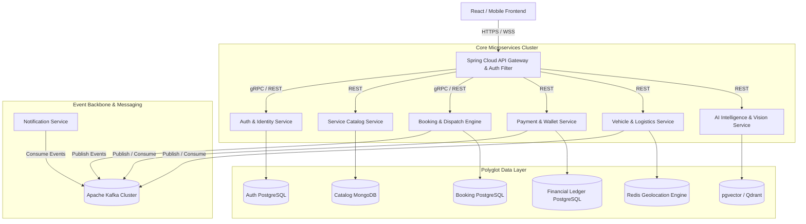
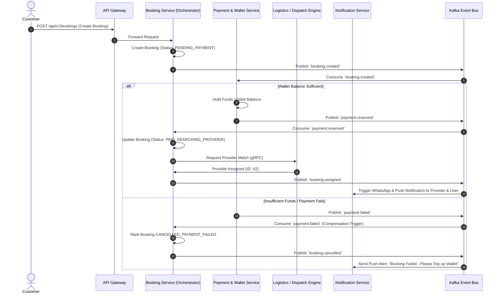
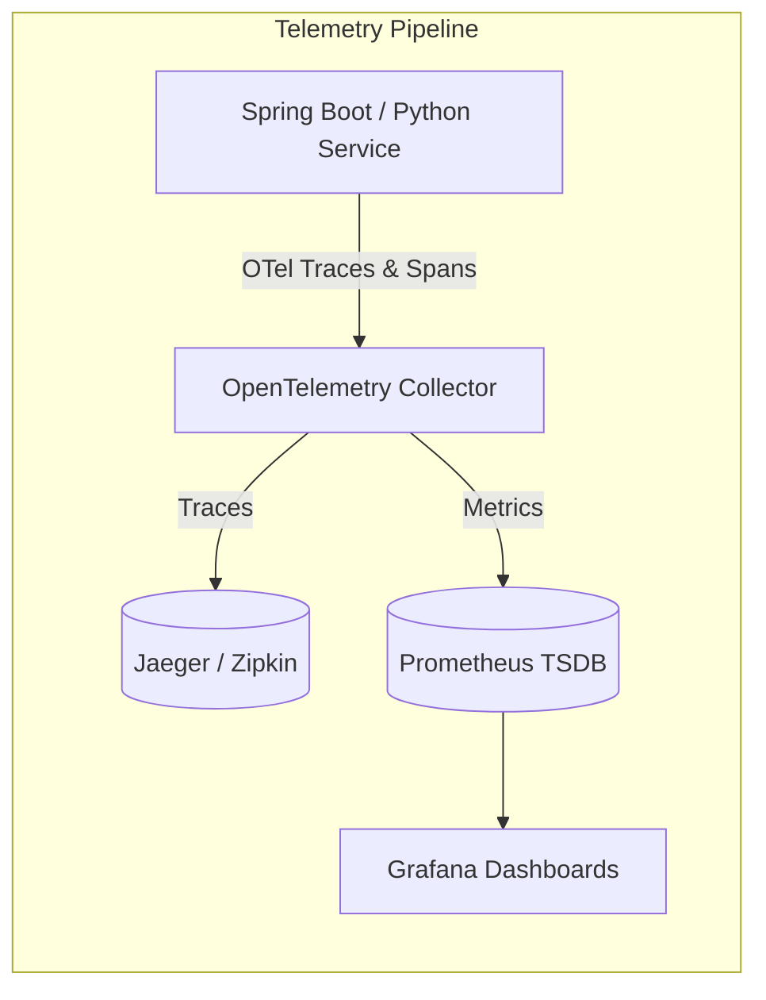

# Taaskr Microservices Migration Architecture Guide
**Author:** Antigravity Architecture Team  
**System Target:** Enterprise On-Demand Marketplace (Taaskr)  
**Status:** Approved Technical Architecture  

---

## 1. Executive Summary & Architectural Vision

Currently, **Taaskr** operates as a modular Spring Boot monolith with a PostgreSQL transactional database. While efficient for rapid initial development, scaling to hundreds of thousands of concurrent booking requests, multi-city logistics routing, and real-time telemetry requires transitioning into a distributed, event-driven microservices architecture.

This document outlines the **Domain-Driven Design (DDD)** decomposition, communication topologies, distributed transaction guarantees, observability, and containerized deployment blueprints.



---

## 2. Bounded Contexts & Service Boundaries

### 2.1 Service Decomposition Matrix

| Microservice | Bounded Context | Core Entities | Primary DB | Sync Protocol | Async Event Topics |
| :--- | :--- | :--- | :--- | :--- | :--- |
| **`auth-service`** | Identity, Roles, Verification | `User`, `Role`, `KycDocument`, `RefreshToken` | PostgreSQL | gRPC / REST | `user.registered`, `kyc.verified` |
| **`catalog-service`** | Services, Categories, Media | `ServiceCategory`, `Service`, `ServiceGallery` | MongoDB | REST | `catalog.service.updated` |
| **`booking-dispatch-service`** | Lifecycle, Matching, Slots | `Booking`, `BookingItem`, `DispatchAssignment` | PostgreSQL | gRPC / REST | `booking.created`, `booking.assigned`, `booking.completed` |
| **`payment-wallet-service`** | Ledger, Razorpay, Payouts | `Wallet`, `Transaction`, `Payout`, `Invoice` | PostgreSQL (Strict ACID) | gRPC / REST | `payment.captured`, `payment.failed`, `payout.processed` |
| **`logistics-service`** | Vehicles, Route, Fare | `Vehicle`, `PricingRule`, `TripRoute`, `DriverShift` | Redis + PostgreSQL | REST | `vehicle.dispatched`, `location.updated` |
| **`notification-service`** | SMS, Email, Push, WebSocket | `NotificationTemplate`, `NotificationLog` | MongoDB | Async Consumer | `notification.dispatched` |
| **`ai-intelligence-service`** | NLP Chat, Vision, Dispatch ML | `ChatSession`, `VisionAuditRecord`, `MLRankingLog` | pgvector / MongoDB | REST / gRPC | `ai.diagnostic.logged` |

---

## 3. Inter-Service Communication & Event Choreography

### 3.1 Synchronous vs. Asynchronous Communication Rules
1. **Synchronous (gRPC / HTTP REST)**: Reserved strictly for real-time validation queries where the caller cannot proceed without an immediate response (e.g., API Gateway validating JWT tokens against `auth-service`, or `booking-service` checking immediate wallet balance with `payment-service`).
2. **Asynchronous (Apache Kafka)**: Used for all business state mutations, notifications, analytics, telemetry, and distributed workflows.

### 3.2 Distributed Transactions: SAGA Pattern for Booking & Payment

When a customer books a service (e.g. AC Repair with upfront wallet lock and provider dispatch), we employ an **Orchestrated SAGA** managed by `booking-dispatch-service`.



---

## 4. API Gateway, Discovery & Security Architecture

### 4.1 Spring Cloud Gateway Route & Filter Definition
The API Gateway acts as the single unified perimeter guarding internal microservices.

```yaml
# application.yml (api-gateway)
server:
  port: 8080

spring:
  cloud:
    gateway:
      discovery:
        locator:
          enabled: true
          lower-case-service-id: true
      routes:
        - id: auth-service
          uri: lb://auth-service
          predicates:
            - Path=/api/v1/auth/**
          filters:
            - name: RequestRateLimiter
              args:
                redis-rate-limiter.replenishRate: 20
                redis-rate-limiter.burstCapacity: 40

        - id: catalog-service
          uri: lb://catalog-service
          predicates:
            - Path=/api/v1/catalog/**, /api/v1/categories/**
          filters:
            - AddResponseHeader=X-Cache-Provider, RedisCacheService

        - id: booking-service
          uri: lb://booking-dispatch-service
          predicates:
            - Path=/api/v1/bookings/**, /api/v1/providers/**
          filters:
            - JwtAuthenticationFilter
            - name: CircuitBreaker
              args:
                name: bookingCircuitBreaker
                fallbackUri: forward:/fallback/booking-down

        - id: ai-service
          uri: lb://ai-intelligence-service
          predicates:
            - Path=/api/v1/ai/**
          filters:
            - JwtAuthenticationFilter
            - name: RequestRateLimiter
              args:
                redis-rate-limiter.replenishRate: 10
                redis-rate-limiter.burstCapacity: 15
```

### 4.2 Distributed JWT Security Protocol
1. User logs in via `auth-service` $\rightarrow$ receives cryptographic RS256 Public-Private Key signed Access Token (`taaskr_jwt`).
2. `api-gateway` caches the Auth Service's **Public Key JWKS** and validates token signatures in memory ($<1\text{ms}$) without calling `auth-service` for every single request.
3. The Gateway injects verified downstream headers:
   - `X-User-Id: 108`
   - `X-User-Email: user@taaskr.com`
   - `X-User-Role: ROLE_CUSTOMER`

---

## 5. Resiliency & Observability Stack



### 5.1 Resilience4j Circuit Breaker Configuration
To prevent cascading failures when external providers or downstream services lag:

```java
@Configuration
public class ResilienceConfig {

    @Bean
    public Customizer<ReactiveResilience4JCircuitBreakerFactory> defaultCustomizer() {
        return factory -> factory.configureDefault(id -> new Resilience4JConfigBuilder(id)
                .circuitBreakerConfig(CircuitBreakerConfig.custom()
                        .slidingWindowSize(10)
                        .failureRateThreshold(50.0f)
                        .waitDurationInOpenState(Duration.ofSeconds(10))
                        .slowCallRateThreshold(50.0f)
                        .slowCallDurationThreshold(Duration.ofSeconds(2))
                        .build())
                .timeLimiterConfig(TimeLimiterConfig.custom()
                        .timeoutDuration(Duration.ofSeconds(3))
                        .build())
                .build());
    }
}
```

---

## 6. Monolith-to-Microservices Migration Roadmap (Strangler Fig)

```
Phase 0: Monolith Modularization (Current State - Clean Packages)
   │
   ▼
Phase 1: Deploy API Gateway & Stand up Auth Service (Isolate Identity)
   │
   ▼
Phase 2: Extract Catalog & Media Service to MongoDB Document Store
   │
   ▼
Phase 3: Extract AI Intelligence & Vision Engine (FastAPI / Spring AI)
   │
   ▼
Phase 4: Split Booking & Financial Ledger into Isolated PostgreSQL DBs
   │
   ▼
Phase 5: Decommission Monolith Kernels
```

### 6.1 Phase Execution Details
1. **Week 1–2 (Perimeter Setup)**: Deploy `Spring Cloud Gateway` in front of the existing Monolith. All traffic from `taaskr-frontend` targets the Gateway.
2. **Week 3–4 (AI & Vision Decoupling)**: Move `AiDiagnosticService` and multimodal vision into `ai-intelligence-service`.
3. **Week 5–6 (Catalog & Media Extraction)**: Shift `Service` and `ServiceCategory` entities to MongoDB document models with instant caching.
4. **Week 7–8 (Transactional Split)**: Carve out `payment-wallet-service` with its own isolated database schema. Connect Kafka CDC (Debezium) for event syncing.

---

## 7. Local Multi-Service Development (Docker Compose)

```yaml
version: '3.8'

services:
  zookeeper:
    image: confluentinc/cp-zookeeper:7.4.0
    environment:
      ZOOKEEPER_CLIENT_PORT: 2181

  kafka:
    image: confluentinc/cp-kafka:7.4.0
    depends_on:
      - zookeeper
    ports:
      - "9092:9092"
    environment:
      KAFKA_BROKER_ID: 1
      KAFKA_ZOOKEEPER_CONNECT: zookeeper:2181
      KAFKA_ADVERTISED_LISTENERS: PLAINTEXT://kafka:29092,PLAINTEXT_HOST://localhost:9092
      KAFKA_LISTENER_SECURITY_PROTOCOL_MAP: PLAINTEXT:PLAINTEXT,PLAINTEXT_HOST:PLAINTEXT
      KAFKA_OFFSETS_TOPIC_REPLICATION_FACTOR: 1

  postgres-booking:
    image: postgres:16-alpine
    environment:
      POSTGRES_DB: taaskr_booking_db
      POSTGRES_USER: taaskr_admin
      POSTGRES_PASSWORD: SecretPassword123
    ports:
      - "5432:5432"

  postgres-payment:
    image: postgres:16-alpine
    environment:
      POSTGRES_DB: taaskr_payment_db
      POSTGRES_USER: taaskr_admin
      POSTGRES_PASSWORD: SecretPassword123
    ports:
      - "5433:5432"

  mongo-catalog:
    image: mongo:7.0
    ports:
      - "27017:27017"
    environment:
      MONGO_INITDB_DATABASE: taaskr_catalog

  redis-cache:
    image: redis:7-alpine
    ports:
      - "6379:6379"

  api-gateway:
    build: ./services/api-gateway
    ports:
      - "8080:8080"
    depends_on:
      - redis-cache
