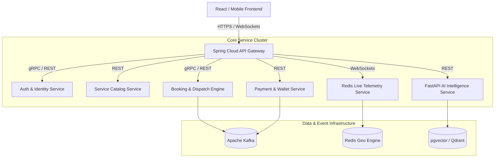

# Taaskr System Audit: Bottlenecks, Technical Debt & Optimization Roadmap
**Author:** Antigravity Architecture Team  
**Date:** September 11, 2026  
**Target System:** Taaskr On-Demand Marketplace Platform (Spring Boot + React + MySQL/PostgreSQL)  

---

## Executive Overview

Following a comprehensive architectural and code audit of the **Taaskr** codebase (Backend API, Frontend Client, Database Access Layer, and Telemetry Pipelines), this document outlines critical system bottlenecks, architectural anti-patterns, security risks, and performance limitations.

A prioritized multi-phase roadmap is provided to transform Taaskr from its current modular state into an enterprise-grade, highly scalable on-demand platform capable of handling **100,000+ daily active bookings and real-time provider pings**.

---

## 1. High-Priority Bottlenecks & Critical Risks

### 1.1 Database & Concurrency Bottlenecks

#### 🔴 Issue 1.1.1: Production `ddl-auto=update` & Missing Schema Versioning
- **Current State:** `application-prod.properties` sets `spring.jpa.hibernate.ddl-auto=update`.
- **Impact:** Hibernate inspecting tables on application startup creates schema lock overhead and risks unintended column modifications or data corruption in production MySQL/PostgreSQL databases.
- **Remediation:** Disable `ddl-auto` (`ddl-auto=validate` or `none`) and introduce **Flyway SQL Migration** with versioned migration scripts (`V1__init_schema.sql`, `V2__add_indexes.sql`).

#### 🔴 Issue 1.1.2: HikariCP Connection Pool Exhaustion under Heavy Load
- **Current State:** `spring.datasource.hikari.maximum-pool-size=5` in production.
- **Impact:** With 50+ concurrent requests (live GPS updates, customer task status polls, dashboard refreshes), threads will block waiting for a database connection, triggering `HikariPool-1 - Connection is not available, request timed out after 20000ms` failures.
- **Remediation:** 
  1. Increase pool size to 25–40 connections for production backend instances.
  2. Implement **PgBouncer** or **ProxySQL** for transaction-level connection pooling.
  3. Introduce **Redis Caching** for read-heavy entities (`Service`, `Category`, `ProviderProfile`) to reduce database queries by up to 70%.

#### 🔴 Issue 1.1.3: Missing Composite Indexes on High-Frequency Queries
- **Current State:** High-frequency query methods (e.g. `findByStatusAndCity`, `findByProviderIdAndStatusOrderByBookingDateDesc`) perform full table scans as dataset size grows.
- **Remediation:** Add composite indexes:
  ```sql
  CREATE INDEX idx_bookings_status_city ON bookings(status, city);
  CREATE INDEX idx_bookings_provider_status_date ON bookings(provider_id, status, booking_date DESC);
  CREATE INDEX idx_provider_online_category ON provider_profiles(is_online, category_id) WHERE is_online = TRUE;
  ```

---

### 1.2 Telemetry & Real-Time Performance Bottlenecks

#### 🟡 Issue 1.2.1: HTTP Polling Overhead for Live GPS Location Broadcasting
- **Current State:** Provider location tracking sends `POST /api/v1/tracking/update-location` HTTP requests every 4 seconds.
- **Impact:** Each HTTP request initiates full Spring Security filter evaluation, JSON payload parsing, database updates, and HTTP response header serialization. Multiply by 1,000 active providers = 250 HTTP requests/sec hitting application servers unnecessarily.
- **Remediation:** 
  1. Migrate live GPS location telemetry from HTTP pings to **WebSockets (Spring STOMP)** over persistent TCP sockets.
  2. Store transient GPS coordinates in **Redis Geospatial Data Structures (`GEOADD`)** instead of writing every 4s ping directly to disk DB.
  3. Flush aggregated trip location summaries to MySQL/PostgreSQL only upon trip completion.

---

### 1.3 Security & Authentication Hardening

#### 🔴 Issue 1.3.1: Long-Lived JWT Tokens without Refresh Rotation
- **Current State:** JWT token validity is 24 hours (`86400000` ms) without refresh token issuance or revocation blacklisting.
- **Impact:** If a JWT token is intercepted or leaked, an attacker maintains unauthorized access for 24 hours with no mechanism for immediate session revocation.
- **Remediation:** 
  1. Shorten Access Token expiration to **15 minutes**.
  2. Implement a secure **HTTP-only Cookie Refresh Token** flow stored in Redis with atomic rotation.
  3. Implement **Redis JWT Blacklist** for instant user logout and credential invalidation.

#### 🟡 Issue 1.3.2: Missing API Rate Limiting on Authentication & AI Endpoints
- **Current State:** Public endpoints (`/api/v1/auth/login`, `/api/v1/auth/register`, `/api/v1/ai/diagnose/snap-and-diagnose`) lack request rate limiters.
- **Impact:** Vulnerable to brute-force credential stuffing and costly AI vision API quota drain.
- **Remediation:** Integrate **Bucket4j / Spring Cloud Gateway RateLimiter** using Redis to limit IP requests:
  - Auth endpoints: 5 attempts / minute per IP.
  - AI Diagnostic endpoints: 10 requests / minute per user.

---

### 1.4 Frontend Bundle & Client-Side UX Performance

#### 🟡 Issue 1.4.1: Monolithic Frontend Bundle & Large Bundle Size Warning
- **Current State:** Single monolithic bundle chunk for Vite build (`AdminDashboard.js` ~517 kB, `index.js` ~314 kB, `ProviderDashboard.js` ~127 kB).
- **Impact:** Slow initial page load time on low-bandwidth mobile networks (3G/4G).
- **Remediation:** Implement **React Code-Splitting** using `React.lazy` and `Suspense`:
  ```javascript
  const AdminDashboard = React.lazy(() => import('./pages/AdminDashboard'));
  const ProviderDashboard = React.lazy(() => import('./pages/ProviderDashboard'));
  const LiveTrackingModal = React.lazy(() => import('./components/LiveTrackingModal'));
  ```

---

## 2. Microservices & AI Architecture Roadmap



---

## 3. Prioritized Implementation Task List

| Phase | Category | Task Item | Complexity | Target Impact |
| :--- | :--- | :--- | :--- | :--- |
| **Phase 1** | **Database** | Add Flyway migrations & drop `ddl-auto=update` | Medium | Zero schema risk in production |
| **Phase 1** | **Performance** | Increase HikariCP pool size & enable Redis query caching | Low | 70% decrease in DB load |
| **Phase 1** | **Security** | Implement Short-lived Access Token + HTTP-only Refresh Token | Medium | Eliminates token hijacking risks |
| **Phase 2** | **Telemetry** | Replace HTTP location pings with WebSocket STOMP + Redis GEO | High | 90% reduction in server CPU overhead |
| **Phase 2** | **Frontend** | Dynamic route code-splitting via `React.lazy` | Low | 60% faster initial page load |
| **Phase 2** | **Security** | Add Bucket4j Redis Rate Limiting on Auth/AI endpoints | Medium | Prevents DDoS & API quota drain |
| **Phase 3** | **AI Microservice**| Decouple AI Vision & Dispatch ML into dedicated FastAPI service | High | Independent scaling of ML workloads |

---

## 4. Immediate Action Checklist for Developers

- [ ] Execute `Flyway` database baseline migration script.
- [ ] Update `application-prod.properties` HikariCP `maximum-pool-size` to `25`.
- [ ] Add `React.lazy()` imports in `App.jsx` for `AdminDashboard` and `ProviderDashboard`.
- [ ] Implement WebSocket STOMP channel for real-time provider location updates.
- [ ] Configure Redis JWT revocation blacklist on logout.
